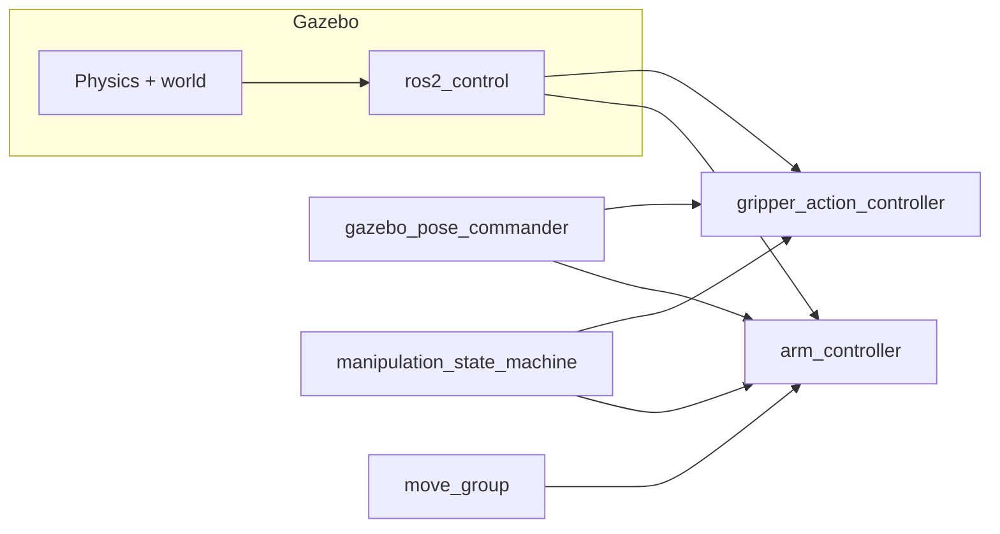

# myCobot 280 JN — Simulation Workspace

ROS 2 Humble workspace for the Elephant Robotics myCobot 280 Jetson Nano with adaptive gripper: RViz demos, Gazebo physics, hand-tuned pick-and-place, and MoveIt 2 planning.

**Environment:** Ubuntu host with Docker container `mycobot-humble` (`/home/raj/mycobot_ws` ↔ `/root/mycobot_ws`). All `colcon build` and `ros2` commands run **inside Docker** unless noted.

For Docker setup, X11 forwarding, and daily host commands, see [myCobot_280_JN_Docker_Simulation_Guide.md](myCobot_280_JN_Docker_Simulation_Guide.md).

---

## Packages

| Package | Purpose |
|---------|---------|
| [`mycobot_ros2/`](mycobot_ros2/) | Upstream Elephant Robotics packages (`humble` branch) |
| [`mycobot_280jn_sim/`](mycobot_280jn_sim/) | Gazebo world, URDF/xacro, `ros2_control` controllers |
| [`mycobot_sim_projects/`](mycobot_sim_projects/) | Python learning nodes, pose commander, gripper, FSM, UI |
| [`mycobot_280jn_moveit_config/`](mycobot_280jn_moveit_config/) | MoveIt 2 config + Gazebo-linked launch files |

---

## Architecture



Python nodes and MoveIt both send goals to the **same** action servers:

- `/arm_controller/follow_joint_trajectory`
- `/gripper_action_controller/gripper_cmd`

---

## Quick start — Gazebo + cube pick

Inside Docker:

```bash
source /opt/ros/humble/setup.bash
source /root/mycobot_ws/install/setup.bash

# Terminal 1 — simulation + controllers
ros2 launch mycobot_280jn_sim gazebo_sim.launch.py

# Terminal 2 — full top-down pick (25 mm cube)
ros2 run mycobot_sim_projects gazebo_pose_commander -- pick_cube
```

**Rebuild after code or world changes:**

```bash
colcon build --packages-select mycobot_280jn_sim mycobot_sim_projects mycobot_280jn_moveit_config
```

**After changing the world file** (cube size, table, etc.): stop Gazebo completely and relaunch — a running sim will not reload the world.

**Verify installed cube size:**

```bash
grep "Cube size" /root/mycobot_ws/install/mycobot_280jn_sim/share/mycobot_280jn_sim/worlds/mycobot_table.sdf
# Expected: 0.025 m (25 mm)
```

---

## Runnable commands

All nodes live in `mycobot_sim_projects` unless noted.

| Command | Purpose | When to use |
|---------|---------|-------------|
| `ros2 launch mycobot_280jn_sim gazebo_sim.launch.py` | Gazebo + robot + controllers | Required first for sim work |
| `ros2 run mycobot_sim_projects gazebo_pose_commander -- pick_cube` | **Full calibrated cube pick** | Primary pick demo |
| `ros2 run mycobot_sim_projects gazebo_pose_commander -- grasp_approach` | Single named arm pose | Debug pick step-by-step |
| `ros2 run mycobot_sim_projects gazebo_pose_commander -- grasp_hover` | Mid-descent / lift stage | Debug pick step-by-step |
| `ros2 run mycobot_sim_projects gazebo_pose_commander -- grasp_descend` | Pre-close height | Debug pick step-by-step |
| `ros2 run mycobot_sim_projects gazebo_pose_commander -- grasp_lift` | Lift stage 1 | After manual close |
| `ros2 run mycobot_sim_projects gazebo_pose_commander -- grasp_retract` | Lift stage 2 | After manual close |
| `ros2 run mycobot_sim_projects gripper_commander -- open` | Open gripper | Gripper only |
| `ros2 run mycobot_sim_projects gripper_commander -- close` | Close gripper | Gripper only |
| `ros2 run mycobot_sim_projects manipulation_state_machine` | Generic demo FSM (CLI) | Learn state machines |
| `ros2 run mycobot_sim_projects manipulation_state_machine_ui` | Demo FSM with Tkinter GUI | Visual FSM monitoring |
| `ros2 run mycobot_sim_projects keyboard_control` | Keyboard joint jog | Early learning |
| `ros2 run mycobot_sim_projects pose_sequence` | Smooth pose cycle | Early learning |
| `ros2 run mycobot_sim_projects joint_monitor` | Joint limit monitor | Safety observation |
| `ros2 run mycobot_sim_projects tf_explorer` | Print gripper TF | FK / frames check |
| `ros2 launch mycobot_sim_projects display_rviz.launch.py` | RViz only (no Gazebo) | URDF visualization |
| `ros2 launch mycobot_280jn_moveit_config gazebo_move_group.launch.py` | MoveIt move_group | Planning (needs Gazebo) |
| `ros2 launch mycobot_280jn_moveit_config gazebo_moveit_rviz.launch.py` | MoveIt RViz panel | Plan in RViz (needs move_group) |

### Important: pick logic lives in one place

| Task | File |
|------|------|
| **Calibrated cube pick** | [`gazebo_pose_commander.py`](mycobot_sim_projects/mycobot_sim_projects/gazebo_pose_commander.py) — `pick_cube` command |
| **Generic demo sequence** | [`manipulation_state_machine.py`](mycobot_sim_projects/mycobot_sim_projects/manipulation_state_machine.py) — not tuned for the 25 mm cube |

---

## Pick-cube summary

**Target:** `pick_cube` model in [`mycobot_table.sdf`](mycobot_280jn_sim/worlds/mycobot_table.sdf)

- Size: **25 mm** cube
- World pose: **(0.20, 0.00, 0.4125)**
- Friction: mu = 2.5 (reduces slip during lift)

**Sequence** (all in `gazebo_pose_commander.py`):

```
open → grasp_approach → grasp_hover → grasp_descend
     → close → hold 0.8 s → grasp_lift → grasp_retract
```

**Design rules:**

- Top-down wrist: `joint1 ≈ 0.33`, fixed `j5`/`j6`; only `j2`–`j4` change for vertical motion
- Descend stops **above** the cube; close achieves the grasp (do not drive TCP into the cube)
- Lift mirrors descend in two stages (hover, then retract) — never jump descend → approach in one move
- Gripper close uses a **3 s timeout** with `proceed_on_timeout=True` so the sequence continues when fingers stall on the cube

| Issue fixed | Solution |
|-------------|----------|
| Gripper beside cube (XY offset) | Restored `joint1 ≈ 0.330216` for top-down poses |
| Cube too large for gripper | Shrunk from 40 mm → **25 mm** |
| Cube size not updating in sim | CMake **real copy** of world file (symlink fix) |
| No pickup — gripper too high | FK retune: descend TCP ~54 mm |
| Table collision on descend | Staged approach → hover → descend |
| Grip OK but no lift | Two-stage lift: `grasp_lift` → `grasp_retract` |
| Hang after close | Gripper close timeout; proceed to lift |

Full joint values, tuning knobs, and GPT handoff text: [`mycobot_sim_projects/PICK_CUBE_HANDOFF.md`](mycobot_sim_projects/PICK_CUBE_HANDOFF.md).

---

## MoveIt 2

MoveIt plans collision-aware paths; `gazebo_pose_commander` executes hand-tuned poses. They share the same `arm_controller` but serve different purposes today.

**Prerequisites:** Gazebo running (`gazebo_sim.launch.py`).

```bash
# Terminal 1 — already running Gazebo

# Terminal 2 — move_group
ros2 launch mycobot_280jn_moveit_config gazebo_move_group.launch.py

# Terminal 3 — RViz MotionPlanning panel
ros2 launch mycobot_280jn_moveit_config gazebo_moveit_rviz.launch.py
```

In RViz: select planning group **arm**, choose named target **grasp_approach** (matches tuned pick pose), Plan & Execute.

**SRDF collision pairs added** (mesh false positives on adaptive gripper):

- `gripper_base` ↔ `joint2`, `joint3` — goal state in collision
- `gripper_right1` ↔ `gripper_right2` — path validation failure

Config: [`mycobot_280jn_sim.srdf`](mycobot_280jn_moveit_config/config/mycobot_280jn_sim.srdf)

Deep theory: [THEORY.md — MoveIt section](mycobot_sim_projects/THEORY.md#moveit-integration-mycobot_280jn_moveit_config--in-progress).

---

## FSM UI

Tkinter panel for the generic demo state machine (not the calibrated `pick_cube`):

```bash
# Host: allow GUI from Docker
xhost +local:docker

# Inside Docker (needs DISPLAY)
ros2 run mycobot_sim_projects manipulation_state_machine_ui
```

Features: state flow diagram with color highlights, Start / Stop / Reset, arm duration and pause settings, log panel.

---

## Changelog (session summary)

- **Gazebo sim package** (`mycobot_280jn_sim`): world with table + dynamic cube, URDF with adaptive gripper mimic joints, `arm_controller` + `gripper_action_controller`
- **Top-down pick** (`gazebo_pose_commander.py`): FK-calibrated poses, staged descend/lift, gripper timeouts
- **World tuning**: 25 mm cube, high friction, CMake install copies world file (fixes Docker/host symlink breakage)
- **MoveIt config** (`mycobot_280jn_moveit_config`): Setup Assistant output + `gazebo_move_group` / `gazebo_moveit_rviz` launches with `use_sim_time`
- **SRDF fixes**: self-collision exemptions for gripper and arm links
- **FSM UI** (`manipulation_state_machine_ui.py`): visual control for demo state machine
- **Docs**: this README, [PICK_CUBE_HANDOFF.md](mycobot_sim_projects/PICK_CUBE_HANDOFF.md), expanded [THEORY.md](mycobot_sim_projects/THEORY.md)

---

## Documentation index

| Document | Contents |
|----------|----------|
| [README.md](README.md) (this file) | Workspace hub — packages, commands, quick start |
| [myCobot_280_JN_Docker_Simulation_Guide.md](myCobot_280_JN_Docker_Simulation_Guide.md) | Docker, X11, host vs container commands |
| [mycobot_sim_projects/THEORY.md](mycobot_sim_projects/THEORY.md) | Control theory per node (state machines, timing, pick math) |
| [mycobot_sim_projects/PICK_CUBE_HANDOFF.md](mycobot_sim_projects/PICK_CUBE_HANDOFF.md) | Full pick-cube tuning history and joint values |

---

## Learning path

| Step | Topic | Status |
|------|-------|--------|
| 1 | URDF in RViz | Done — `display_rviz.launch.py` |
| 2 | Slider / keyboard joint control | Done — upstream + `keyboard_control` |
| 3 | `/joint_states` and TF | Done — `joint_monitor`, `tf_explorer` |
| 4 | Python pose nodes | Done — `pose_sequence`, `gazebo_pose_commander` |
| 5 | Gazebo + `ros2_control` | **Done** — `mycobot_280jn_sim` |
| 6 | MoveIt 2 motion planning | **In progress** — config exists; SRDF tuning ongoing |
| 7 | Fixed-position pick-and-place | **Done** — `pick_cube` |
| 8+ | Obstacle avoidance, cameras, ML | Not started |

---

## Troubleshooting

| Symptom | Fix |
|---------|-----|
| Cube still 40 mm in Gazebo | Rebuild `mycobot_280jn_sim`, full Gazebo restart, verify install path with `grep "Cube size"` |
| `EACCES` editing MoveIt files on host | `sudo chown -R $USER:$USER ~/mycobot_ws/src/mycobot_280jn_moveit_config` |
| Pick hangs after gripper close | Rebuild `mycobot_sim_projects` — close timeout fix must be installed |
| MoveIt plan fails / invalid path | Check SRDF `disable_collisions`; see MoveIt section above |
| RViz/UI won't open in Docker | Run `xhost +local:docker` on host; pass `-e DISPLAY=$DISPLAY` |
| Stale nodes after container restart | Re-source: `source /opt/ros/humble/setup.bash && source /root/mycobot_ws/install/setup.bash` |
