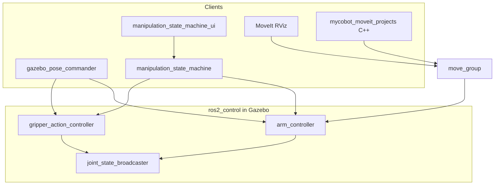
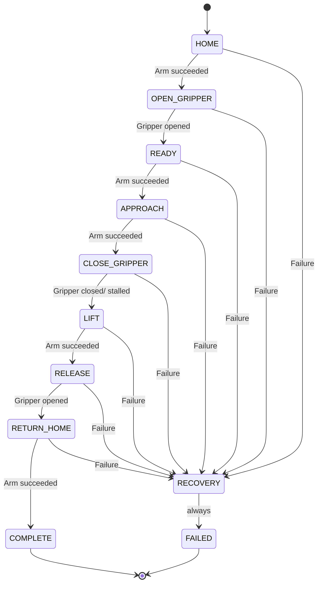
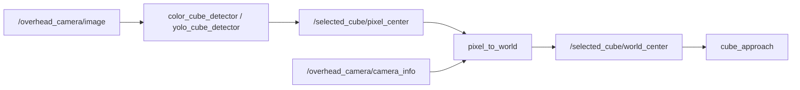

# myCobot 280 JN — Simulation Workspace

ROS 2 Humble workspace for the Elephant Robotics myCobot 280 Jetson Nano with adaptive gripper: RViz learning demos, Gazebo physics, hand-tuned pick-and-place, MoveIt 2 planning, and C++ MoveIt exercises.

**Environment:** Ubuntu host + Docker container `mycobot-humble`. Workspace bind-mount: `/home/raj/mycobot_ws` ↔ `/root/mycobot_ws`.

**Always inside Docker before any ROS command:**

```bash
source /opt/ros/humble/setup.bash
source /root/mycobot_ws/install/setup.bash
```

Docker setup, X11, and host-vs-container rules: [myCobot_280_JN_Docker_Simulation_Guide.md](myCobot_280_JN_Docker_Simulation_Guide.md).

---

## Table of contents

1. [Which tool should I use?](#which-tool-should-i-use)
2. [Packages](#packages)
3. [Architecture](#architecture)
4. [Build](#build)
5. [Quick-start workflows](#quick-start-workflows)
6. [All commands reference](#all-commands-reference)
7. [State machine (theory + usage)](#state-machine-theory--usage)
8. [Pick-cube (calibrated grasp)](#pick-cube-calibrated-grasp)
9. [Vision-guided pick (multi-color cubes)](#vision-guided-pick-multi-color-cubes)
10. [YOLO vision-guided pick-and-place (step 17)](#yolo-vision-guided-pick-and-place-step-17)
11. [MoveIt 2](#moveit-2)
12. [Controllers and action servers](#controllers-and-action-servers)
13. [Theory document map](#theory-document-map)
14. [Learning path](#learning-path)
15. [Changelog](#changelog)
16. [Documentation index](#documentation-index)
17. [Remember for the future](#remember-for-the-future)
18. [Troubleshooting](#troubleshooting)

---

## Which tool should I use?

| Goal | Use this | Not this |
|------|----------|----------|
| Pick the 25 mm cube reliably (fixed pose) | `gazebo_pose_commander -- pick_cube` | `manipulation_state_machine` (generic poses) |
| Pick by vision (red / green / blue cube) | `cube_approach.launch.py target_color:=...` (YOLO default) | `pick_cube` (fixed FK poses only) |
| Sort all three cubes by colour (autonomous) | `sort_cubes.launch.py` (add `detector:=yolo` for YOLO) | Manual three launches with wrong `target_color` |
| Train / run YOLO cube detector | See [YOLO handoff](mycobot_sim_projects/YOLO_VISION_GUIDED_PICK_AND_PLACE.md) | HSV-only `color_cube_detector` for production without training |
| Learn state machines visually | `manipulation_state_machine_ui` | — |
| Plan collision-aware paths in RViz | MoveIt `gazebo_move_group` + RViz | Raw joint publishing |
| Cartesian straight-line descend demo | `mycobot_moveit_projects cartesian_path` | `pose_target` (uses OMPL IK, not Cartesian interpolation) |
| Move to SRDF named states from C++ | `mycobot_moveit_projects named_targets` | — |
| Cartesian descend demo (FK→IK→OMPL) | `mycobot_moveit_projects pose_target` | — |
| Add table/cube to MoveIt planning scene | `planning_scene_objects` | — |
| Test obstacle blocking at grasp pose | `test_obstacle` | — |
| URDF learning without physics | `display_rviz.launch.py` | Gazebo |
| Manual joint jog | `keyboard_control` | — |

**Rule of thumb:** `gazebo_pose_commander.py` owns **all calibrated pick logic**. `manipulation_state_machine.py` is a **generic demo template** with its own poses.

---

## Packages

| Package | Purpose | Key files |
|---------|---------|-----------|
| [`mycobot_ros2/`](mycobot_ros2/) | Upstream Elephant Robotics (`humble` branch) | Slider GUIs, descriptions |
| [`mycobot_280jn_sim/`](mycobot_280jn_sim/) | Gazebo sim | `gazebo_sim.launch.py`, `mycobot_table.sdf`, `controllers.yaml`, URDF |
| [`mycobot_sim_projects/`](mycobot_sim_projects/) | Python nodes + theory | `gazebo_pose_commander.py`, `color_cube_detector.py`, `yolo_cube_detector.py`, `generate_yolo_dataset.py`, `pixel_to_world.py`, `THEORY.md` |
| [`mycobot_yolo_assets/`](mycobot_yolo_assets/) | YOLO dataset + weights (GitHub) | `assets/dataset/`, `assets/runs/cube_detector/weights/best.pt`, `assets/yolo11n.pt` |
| [`mycobot_280jn_moveit_config/`](mycobot_280jn_moveit_config/) | MoveIt 2 config | SRDF, OMPL, `gazebo_move_group.launch.py` |
| [`mycobot_moveit_projects/`](mycobot_moveit_projects/) | C++ MoveIt demos | `named_targets`, `pose_target`, `cartesian_path`, `cube_approach`, `sort_cubes`, `planning_scene_objects`, `test_obstacle` |

---

## Architecture



**Action servers (shared by all arm/gripper clients):**

| Server | Type |
|--------|------|
| `/arm_controller/follow_joint_trajectory` | `control_msgs/action/FollowJointTrajectory` |
| `/gripper_action_controller/gripper_cmd` | `control_msgs/action/GripperCommand` |

**Two control paths:**

| Path | Nodes | Physics |
|------|-------|---------|
| **Sim / ros2_control** | `gazebo_pose_commander`, FSM, MoveIt | Real Gazebo physics |
| **RViz-only** | `pose_sequence`, `keyboard_control` | Publishes `/joint_states` directly (no physics) |

---

## Build

```bash
cd /root/mycobot_ws
colcon build --symlink-install --packages-select \
  mycobot_yolo_assets \
  mycobot_280jn_sim \
  mycobot_sim_projects \
  mycobot_280jn_moveit_config \
  mycobot_moveit_projects
source install/setup.bash
```

Rebuild after editing any of those packages. **Full Gazebo restart** required after world/URDF changes.

Verify cube size in install tree:

```bash
grep "Cube size" install/mycobot_280jn_sim/share/mycobot_280jn_sim/worlds/mycobot_table.sdf
# Expected: 0.025 m (25 mm)
```

---

## Quick-start workflows

### A — Gazebo + cube pick (primary demo)

```bash
# Terminal 1
ros2 launch mycobot_280jn_sim gazebo_sim.launch.py

# Terminal 2
ros2 run mycobot_sim_projects gazebo_pose_commander -- pick_cube
```

### B — Gazebo + state machine UI

```bash
# Host first
xhost +local:docker

# Terminal 1 — Gazebo (as above)

# Terminal 2
ros2 run mycobot_sim_projects manipulation_state_machine_ui
```

### C — Gazebo + MoveIt (plan in RViz)

```bash
# Terminal 1 — Gazebo

# Terminal 2
ros2 launch mycobot_280jn_moveit_config gazebo_move_group.launch.py

# Terminal 3
ros2 launch mycobot_280jn_moveit_config gazebo_moveit_rviz.launch.py
```

In RViz: group **arm** → target **grasp_approach** → Plan & Execute.

Optional — sync MoveIt planning scene with Gazebo objects:

```bash
ros2 run mycobot_moveit_projects planning_scene_objects
```

### D — Gazebo + MoveIt C++ demos

```bash
# Terminals 1–2 as in workflow C, then:

ros2 launch mycobot_moveit_projects named_targets.launch.py
# or
ros2 launch mycobot_moveit_projects pose_target.launch.py
# or
ros2 launch mycobot_moveit_projects cartesian_path.launch.py
# or — single vision-guided pick (red / green / blue)
ros2 launch mycobot_moveit_projects cube_approach.launch.py target_color:=green
```

### E — Autonomous colour sort (red → green → blue)

Requires Gazebo + MoveIt (`gazebo_moveit_stack.launch.py`). Resets cubes in Gazebo between runs if needed. YOLO is the default detector in `cube_approach.launch.py`.

```bash
# Terminal 1
ros2 launch mycobot_280jn_moveit_config gazebo_moveit_stack.launch.py

# Terminal 2
ros2 run mycobot_sim_projects gripper_commander -- open
ros2 launch mycobot_moveit_projects sort_cubes.launch.py
```

Each colour is picked with vision and placed in a row at **y = 0.20**:

| Colour | Place X (MoveIt `world`) |
|--------|--------------------------|
| red | 0.10 |
| green | 0.00 |
| blue | −0.10 |

The sequence stops on the first failed pick (checks for `Pick-and-place complete` in the log).

### F — Sim Workbench GUI (Gazebo + MoveIt pick-and-place)

Single Tkinter panel — no need to copy commands across terminals:

```bash
colcon build --symlink-install --packages-select mycobot_sim_projects mycobot_moveit_projects
source install/setup.bash
ros2 run mycobot_sim_projects sim_workbench_ui
```

1. **Start Gazebo + MoveIt (recommended)** — one combined process, synced sim clock. Or start **Gazebo** → **move_group** separately (optional **RViz**).
2. **Open gripper** → **Go home** (wait ~6 s after home).
3. Set place **X/Y/Z** and **Release Z** → **Run cube_approach**.

Combined stack from the terminal:

```bash
ros2 launch mycobot_280jn_moveit_config gazebo_moveit_stack.launch.py
```

Place override from the GUI spinboxes, or from the terminal:

```bash
ros2 launch mycobot_moveit_projects cube_approach.launch.py \
  place_x:=0.12 place_y:=0.18 place_z:=0.140 place_descend_z:=0.055
```

Full sequence: pick → staged lift → place approach → place descend → release → retract → home.

Requires X11/`DISPLAY` (same as `manipulation_state_machine_ui`). See [Docker guide](myCobot_280_JN_Docker_Simulation_Guide.md).

### G — RViz only (no Gazebo)

```bash
ros2 launch mycobot_sim_projects display_rviz.launch.py
ros2 run mycobot_sim_projects pose_sequence
```

---

## All commands reference

### Gazebo + sim (`mycobot_280jn_sim`, `mycobot_sim_projects`)

| Command | Purpose |
|---------|---------|
| `ros2 launch mycobot_280jn_sim gazebo_sim.launch.py` | Gazebo + robot + controllers |
| `ros2 run mycobot_sim_projects gazebo_pose_commander -- pick_cube` | **Full calibrated pick** |
| `ros2 run mycobot_sim_projects gazebo_pose_commander -- <pose>` | Single pose (`home`, `grasp_approach`, `grasp_hover`, …) |
| `ros2 run mycobot_sim_projects gripper_commander -- open\|close\|wide` | Gripper only |
| `ros2 run mycobot_sim_projects manipulation_state_machine` | Generic FSM (CLI) |
| `ros2 run mycobot_sim_projects manipulation_state_machine_ui` | Generic FSM (GUI) |
| `ros2 run mycobot_sim_projects sim_workbench_ui` | **Sim Workbench** — Gazebo + MoveIt + cube_approach (GUI) |
| `ros2 run mycobot_sim_projects keyboard_control` | Keyboard joint jog |
| `ros2 run mycobot_sim_projects pose_sequence` | Smooth pose cycle |
| `ros2 run mycobot_sim_projects joint_monitor` | Joint limit warnings |
| `ros2 run mycobot_sim_projects tf_explorer` | Print gripper TF |
| `ros2 launch mycobot_sim_projects display_rviz.launch.py` | RViz URDF demo |

**`gazebo_pose_commander` useful flags:** `--duration 5.0` (seconds per arm move)

**Available poses** (single-pose mode): `home`, `ready`, `observe`, `left_ready`, `grasp_approach`, `grasp_hover`, `grasp_descend`, `grasp_lift`, `grasp_retract`, `grasp`, plus legacy `pick_*` and `top_pick_*` aliases. Use `pick_cube` for the full calibrated sequence.

**FSM useful flags:** `--arm-duration 5.0`, `--pause 0.5`

### MoveIt (`mycobot_280jn_moveit_config`, `mycobot_moveit_projects`)

| Command | Purpose |
|---------|---------|
| `ros2 launch mycobot_280jn_moveit_config gazebo_move_group.launch.py` | Planning server |
| `ros2 launch mycobot_280jn_moveit_config gazebo_moveit_rviz.launch.py` | RViz MotionPlanning |
| `ros2 launch mycobot_moveit_projects named_targets.launch.py` | C++: `home` → `grasp_approach` → `home` |
| `ros2 launch mycobot_moveit_projects pose_target.launch.py` | C++: approach → Z−3 cm → home |
| `ros2 launch mycobot_moveit_projects cartesian_path.launch.py` | C++: Cartesian straight Z−3 cm at `grasp_approach` (needs Gazebo first) |
| `ros2 launch mycobot_moveit_projects cube_approach.launch.py` | C++: vision pick-and-place — **YOLO default** (`detector:=hsv` for HSV fallback) |
| `ros2 launch mycobot_moveit_projects cube_approach.launch.py detector:=yolo target_color:=blue place_x:=0.10 place_y:=0.20` | YOLO pick with explicit place pose |
| `ros2 launch mycobot_moveit_projects sort_cubes.launch.py` | **Autonomous sort:** red → green → blue; add `detector:=yolo` (YOLO) or omit for default YOLO |
| `ros2 run mycobot_sim_projects color_cube_detector --ros-args -p target_color:=blue` | OpenCV HSV cube detection (step 15 fallback) |
| `ros2 run mycobot_sim_projects yolo_cube_detector --ros-args -p use_sim_time:=true -p target_color:=blue` | YOLO cube detection only (step 17) |
| `ros2 run mycobot_sim_projects generate_yolo_dataset --ros-args -p samples:=300 -p use_sim_time:=true` | Auto-generate YOLO training images/labels |
| `ros2 run mycobot_sim_projects pixel_to_world` | Pixel → MoveIt `world` (step 15) |
| `ros2 run mycobot_moveit_projects planning_scene_objects` | Add table + cube to planning scene |
| `ros2 run mycobot_moveit_projects test_obstacle --ros-args -p operation:=add` | Add blocking box at grasp pose |
| `ros2 run mycobot_moveit_projects test_obstacle --ros-args -p operation:=remove` | Remove test obstacle |

Details: [mycobot_moveit_projects/README.md](mycobot_moveit_projects/README.md).

---

## State machine (theory + usage)

Full theory: [THEORY.md — manipulation_state_machine.py](mycobot_sim_projects/THEORY.md#manipulation_state_machinepy--pick-and-place-state-machine).

### What it does

Chains arm + gripper action servers into one **blocking** pick/place demo. Each state runs exactly one action, waits for the result, then transitions. This teaches the **sequencing pattern** used by `pick_cube`, but with **generic poses** not tuned for the 25 mm cube.

**Important:** Calibrated grasp logic lives only in `gazebo_pose_commander.py` (`pick_cube`, `grasp_*` poses). The FSM keeps its own local `ARM_POSES` (`home` / `ready` / `approach` / `lift`) and must not be used for reliable cube picking.

### Theory: sequencing layer (not new motion math)

Each individual arm or gripper move uses the same interpolation and action-handshake model as `gazebo_pose_commander.py` and `gripper_commander.py`. What is new is the **sequencing layer** on top:

| Concept | Behaviour |
|---------|-----------|
| **Blocking chain** | One action per state; `transition()` only runs after `spin_until_future_complete` returns success or failure — steps never overlap |
| **Uniform failure path** | Every failed `move_arm` / `move_gripper` calls `fail()` → `RECOVERY`; no per-state bespoke error handling |
| **RECOVERY is terminal** | Best-effort open + home (return values ignored), then always → `FAILED`; no retry |
| **Gripper stall = success** | On `CLOSE_GRIPPER`, `reached_goal` **or** `stalled` counts as success — stalling against an object is the intended grasp outcome (see controllers section) |

Formal state set:

```
S = {HOME, OPEN_GRIPPER, READY, APPROACH, CLOSE_GRIPPER, LIFT,
     RELEASE, RETURN_HOME, COMPLETE, RECOVERY, FAILED}
```

Transition rule for the eight happy-path states:

```
S(k+1) = next_state   if the state's action succeeds
S(k+1) = RECOVERY     if the state's action fails
```

`RECOVERY` always → `FAILED`. `COMPLETE` and `FAILED` are terminal.

### State flow

```
HOME → OPEN_GRIPPER → READY → APPROACH → CLOSE_GRIPPER
     → LIFT → RELEASE → RETURN_HOME → COMPLETE
```

On any failure → **RECOVERY** (best-effort open + home) → **FAILED** (terminal, no retry).



### State table

| State | Action | On success → | On failure → |
|-------|--------|--------------|--------------|
| `HOME` | `move_arm("home")` | `OPEN_GRIPPER` | `RECOVERY` |
| `OPEN_GRIPPER` | gripper open (0.0 rad) | `READY` | `RECOVERY` |
| `READY` | `move_arm("ready")` | `APPROACH` | `RECOVERY` |
| `APPROACH` | `move_arm("approach")` | `CLOSE_GRIPPER` | `RECOVERY` |
| `CLOSE_GRIPPER` | gripper close (−0.5 rad) | `LIFT` | `RECOVERY` |
| `LIFT` | `move_arm("lift")` | `RELEASE` | `RECOVERY` |
| `RELEASE` | gripper open | `RETURN_HOME` | `RECOVERY` |
| `RETURN_HOME` | `move_arm("home")` | `COMPLETE` | `RECOVERY` |
| `RECOVERY` | open + home (best effort, results ignored) | `FAILED` | `FAILED` |
| `COMPLETE` | terminal — `run()` returns `True` | — | — |
| `FAILED` | terminal — logs `failed_state`, `run()` returns `False` | — | — |

### FSM vs `pick_cube`

| | `manipulation_state_machine` | `gazebo_pose_commander pick_cube` |
|--|------------------------------|-----------------------------------|
| Poses | Generic `home/ready/approach/lift` | FK-tuned `grasp_*` for 25 mm cube |
| Gripper close | Waits for action result | 3 s timeout + `proceed_on_timeout` |
| Lift | Single `lift` pose | Staged `grasp_lift` → `grasp_retract` |
| Purpose | Learn FSM pattern | Reliable sim pick |

### UI (`manipulation_state_machine_ui`)

Same FSM class, Tkinter front-end — **no duplicate FSM logic**. Theory: [THEORY.md — UI layer](mycobot_sim_projects/THEORY.md#ui-layer-manipulation_state_machine_uipy).

**Architecture:** FSM runs in a **background thread**; a `MultiThreadedExecutor` spins the ROS node; the main thread polls `node.state` every 200 ms to repaint the state strip.

**State strip** (`TASK_FLOW` order): gray = pending, yellow = current, green = completed, red = failed state, orange = entire strip during `RECOVERY`.

| Control | Effect |
|---------|--------|
| **Start sequence** | `reset()` then `run()` in worker thread |
| **Stop** | `request_stop()` — checked at start of each loop iteration; current action finishes first |
| **Reset** | `reset()` to `HOME` (disabled while running) |

Timing spinboxes map to `--arm-duration` and `--pause`. Requires `DISPLAY` (`xhost +local:docker` on host). Does **not** run `pick_cube`.

**Run:**

```bash
ros2 run mycobot_sim_projects manipulation_state_machine_ui
# CLI equivalent (no GUI):
ros2 run mycobot_sim_projects manipulation_state_machine
```

---

## Pick-cube (calibrated grasp)

**File:** [`gazebo_pose_commander.py`](mycobot_sim_projects/mycobot_sim_projects/gazebo_pose_commander.py)  
**Target:** 25 mm red `pick_cube` at Gazebo `(0.15, 0.10, 0.4125)` — [`mycobot_table.sdf`](mycobot_280jn_sim/worlds/mycobot_table.sdf). This is a **fixed-pose** Python pick (no camera). For vision-guided multi-color pick, see [Vision-guided pick](#vision-guided-pick-multi-color-cubes).

**Sequence:**

```
open → grasp_approach → grasp_hover → grasp_descend
     → close → hold 0.8 s → grasp_lift → grasp_retract
```

**Design rules:**

- Top-down wrist: `joint1 ≈ 0.330216`; only `j2`–`j4` change for vertical motion
- Descend stops **above** cube; close achieves grasp
- Lift mirrors descend (hover then retract) — never jump descend → approach in one move
- Gripper close: −0.55 rad, 8 N, 3 s timeout with proceed-on-timeout

| Issue fixed | Solution |
|-------------|----------|
| XY offset | `joint1 ≈ 0.33` for top-down |
| Cube too big | 40 mm → 25 mm |
| World not updating | CMake real-copy install |
| Gripper too high | FK retune descend TCP ~54 mm |
| Table collision | Staged approach → hover → descend |
| No lift | Two-stage lift |
| Hang after close | Gripper timeout |

Full joint values and tuning: [PICK_CUBE_HANDOFF.md](mycobot_sim_projects/PICK_CUBE_HANDOFF.md).

---

## Vision-guided pick (multi-color cubes)

**Learning path steps 14–17.** Curriculum topics: simulated RGB camera + intrinsics; OpenCV color segmentation + table-plane 3D (step 15); YOLO11n multi-class detection (step 17). *Not yet implemented: depth image, point cloud, tf2 camera lookup.*

Theory: [THEORY.md §08–09](mycobot_sim_projects/THEORY.md#overhead-rgb-camera--bridge-step-14). MoveIt details: [mycobot_moveit_projects/README.md](mycobot_moveit_projects/README.md#cube_approach-pick-and-place). **Full YOLO handoff (training, metrics, diagnostics):** [YOLO_VISION_GUIDED_PICK_AND_PLACE.md](mycobot_sim_projects/YOLO_VISION_GUIDED_PICK_AND_PLACE.md).

### Pipeline



1. **Detection** — `color_cube_detector` (HSV) or `yolo_cube_detector` (trained YOLO) finds the target cube and publishes its pixel centre.
2. **Pinhole projection** — `pixel_to_world` uses `CameraInfo` intrinsics + fixed camera pose to map pixels → table plane in MoveIt `world`.
3. **Frame conversion** — Gazebo world Z minus **0.405 m** = MoveIt `world` (robot base); cube centre Z = **0.0075 m**.
4. **MoveIt pick** — `cube_approach` waits for vision (1.5 s stabilize), rotates `joint2_to_joint1` toward the cube, Cartesian descent, attach/detach in planning scene, place, release.

**`cube_approach` behaviour (verified):**

- Auto-opens gripper at start if a prior pick left it closed (needed for `sort_cubes` chain).
- Lenient gripper open on release — slow sim open no longer aborts retract/home.
- Live detector overlay may show “not detected” while the arm is over the cube; pick uses vision locked **before** motion.

### World layout

| Model | Gazebo pose (x, y, z) | MoveIt `world` (x, y, z) |
|-------|------------------------|---------------------------|
| `pick_cube` (red) | (0.15, 0.10, 0.4125) | (0.15, 0.10, 0.0075) |
| `green_cube` | (0.20, 0.00, 0.4125) | (0.20, 0.00, 0.0075) |
| `blue_cube` | (0.15, -0.10, 0.4125) | (0.15, -0.10, 0.0075) |
| `overhead_camera` | (0.30, -0.25, 1.30) pitch 90° | (0.30, -0.25, 0.895) |

### One-launch pick (recommended)

```bash
source /opt/ros/humble/setup.bash
source /root/mycobot_ws/install/setup.bash

# Terminal 1 — Gazebo + MoveIt (bridges overhead camera; synced sim clock)
ros2 launch mycobot_280jn_moveit_config gazebo_moveit_stack.launch.py

# Terminal 2 — YOLO pick (default detector; HSV fallback shown below)
source /root/yolo_env/bin/activate   # optional — node auto-reexecs if needed
ros2 run mycobot_sim_projects gripper_commander -- open
ros2 launch mycobot_moveit_projects cube_approach.launch.py target_color:=blue

# HSV fallback (classical OpenCV segmentation)
ros2 launch mycobot_moveit_projects cube_approach.launch.py detector:=hsv target_color:=blue
```

Expected `world_center` for blue: **y ≈ -0.10**. Check `cube_approach` log: `Vision cube position: x=..., y=..., z=...`.

Per-colour place targets used in sorting (y = 0.20):

| Colour | Command |
|--------|---------|
| red | `ros2 launch mycobot_moveit_projects cube_approach.launch.py target_color:=red place_x:=0.10 place_y:=0.20` |
| green | `ros2 launch mycobot_moveit_projects cube_approach.launch.py target_color:=green place_x:=0.00 place_y:=0.20` |
| blue | `ros2 launch mycobot_moveit_projects cube_approach.launch.py target_color:=blue place_x:=-0.10 place_y:=0.20` |

`detector:=yolo` is optional — YOLO is already the default in `cube_approach.launch.py`.

### Sort all three cubes

```bash
ros2 launch mycobot_280jn_moveit_config gazebo_moveit_stack.launch.py
# second terminal:
ros2 run mycobot_sim_projects gripper_commander -- open
ros2 launch mycobot_moveit_projects sort_cubes.launch.py
```

Uses [`sort_cubes.launch.py`](mycobot_moveit_projects/launch/sort_cubes.launch.py) — chains three `cube_approach` runs (red → green → blue). Success requires `Pick-and-place complete` in each pick log. YOLO is the default detector; pass `detector:=hsv` to use OpenCV HSV instead.

### Manual vision (separate terminals)

```bash
ros2 run mycobot_sim_projects color_cube_detector \
  --ros-args -p target_color:=blue -p use_sim_time:=true
ros2 run mycobot_sim_projects pixel_to_world --ros-args -p use_sim_time:=true
ros2 topic echo /selected_cube/world_center --once
ros2 launch mycobot_moveit_projects cube_approach.launch.py
```

**Do not** run two `color_cube_detector` nodes with different `target_color` values — they share `/selected_cube/pixel_center`.

### Pre-flight checks

```bash
ros2 topic hz /overhead_camera/image
ros2 topic hz /overhead_camera/camera_info
ros2 topic hz /selected_cube/pixel_center
ros2 topic echo /selected_cube/world_center --once
ros2 pkg executables mycobot_sim_projects | grep color_cube_detector
```

### Expected `world_center` by color

| Color | Expected y (MoveIt world) |
|-------|---------------------------|
| red | ≈ +0.10 |
| green | ≈ 0.00 |
| blue | ≈ -0.10 |

---

## YOLO vision-guided pick-and-place (step 17)

**Project 17** replaces HSV-only cube detection with a trained **YOLO11n** detector. The overhead Gazebo camera detects red, green, and blue cubes; ROS 2 converts the selected detection from pixels to the MoveIt `world` frame; and the existing `cube_approach` node approaches, grasps, lifts, places, and releases the requested cube.

**Full handoff document** (install, dataset generator, training, validation metrics, diagnostics, troubleshooting): [YOLO_VISION_GUIDED_PICK_AND_PLACE.md](mycobot_sim_projects/YOLO_VISION_GUIDED_PICK_AND_PLACE.md)

### Validated stack

| Component | Version / note |
|-----------|----------------|
| ROS 2 Humble | Ubuntu 22.04 in Docker (`mycobot-humble`) |
| Gazebo | Fortress / Ignition Gazebo |
| MoveIt 2 + `ros2_control` | `gazebo_moveit_stack.launch.py` |
| PyTorch | `2.14.0+cpu` (CUDA not required) |
| Ultralytics | `8.4.143` |
| OpenCV | `4.11.0` |
| Base model | YOLO11n (`yolo11n.pt`) |

### Pipeline

```text
/overhead_camera/image
        ↓
yolo_cube_detector          (classes: red_cube, green_cube, blue_cube)
        ↓ /selected_cube/pixel_center
pixel_to_world              (unchanged — pinhole + fixed camera pose)
        ↓ /selected_cube/world_center
cube_approach (MoveIt)
        ↓
approach → descend → close → lift → place → open → home
```

YOLO classes:

| ID | Class |
| ---: | --- |
| 0 | `red_cube` |
| 1 | `green_cube` |
| 2 | `blue_cube` |

### Important paths (Docker: `/root/mycobot_ws/...`)

All YOLO artifacts live in the **`mycobot_yolo_assets`** package under `src/` so they are version-controlled on GitHub (~26 MB total).

| Path | Contents |
|------|----------|
| `src/mycobot_yolo_assets/assets/dataset/` | 310 images, labels, `data.yaml` |
| `src/mycobot_yolo_assets/assets/runs/cube_detector/weights/best.pt` | Trained weights (default at runtime) |
| `src/mycobot_yolo_assets/assets/yolo11n.pt` | Base model for training |
| `/root/yolo_env/` | Python venv with PyTorch + Ultralytics (not in git) |

After `colcon build --symlink-install`, nodes resolve paths via `mycobot_yolo_assets.paths` (installed share directory). With symlink-install, dataset regeneration and retraining update files under `src/` directly for committing.

Quick path check:

```bash
python3 -c "from mycobot_yolo_assets.paths import default_model_path; print(default_model_path())"
```

Camera pose validated to avoid arm occlusion during grasp: **(0.30, -0.25, 1.30)** pitch 90°. Intrinsics: **640×480**, `fx=fy≈554.25`, `cx=320`, `cy=240`.

### Install YOLO environment (one-time)

```bash
apt update
apt install -y python3-pip python3-venv
python3 -m venv --system-site-packages /root/yolo_env
source /root/yolo_env/bin/activate
python3 -m pip install "numpy<2"
python3 -m pip install torch torchvision --index-url https://download.pytorch.org/whl/cpu
python3 -m pip install ultralytics
```

Verify:

```bash
source /opt/ros/humble/setup.bash
source /root/mycobot_ws/install/setup.bash
source /root/yolo_env/bin/activate
python3 - <<'PY'
import torch, ultralytics, cv2
from cv_bridge import CvBridge
print("PyTorch:", torch.__version__)
print("CUDA:", torch.cuda.is_available())
print("Ultralytics:", ultralytics.__version__)
print("OpenCV:", cv2.__version__)
print("cv_bridge: OK")
PY
```

If pip reports a hash mismatch, purge cache and retry — **never** disable verification:

```bash
python3 -m pip cache purge
python3 -m pip install --no-cache-dir --retries 10 --timeout 120 \
  "numpy>=1.23.5,<2" ultralytics
```

### Build after YOLO integration

```bash
cd /root/mycobot_ws
source /opt/ros/humble/setup.bash
source /root/yolo_env/bin/activate
colcon build --symlink-install --packages-select \
  mycobot_yolo_assets mycobot_sim_projects mycobot_moveit_projects
source install/setup.bash
```

### Step 1 — Generate dataset

Gazebo must be running (`gazebo_sim.launch.py` or `gazebo_moveit_stack.launch.py`). The generator randomizes cube poses via Gazebo `set_pose`, waits **6 fresh camera frames** after each move (avoids stale labels), and writes YOLO labels using HSV **for annotation only** — runtime detection uses YOLO.

Smoke test (10 samples):

```bash
ros2 run mycobot_sim_projects generate_yolo_dataset \
  --ros-args -p use_sim_time:=true -p samples:=10
```

Full dataset (300 more → **310 total**):

```bash
ros2 run mycobot_sim_projects generate_yolo_dataset \
  --ros-args -p use_sim_time:=true -p samples:=300
```

Default `output_directory` is `mycobot_yolo_assets/assets/dataset/` (via `mycobot_yolo_assets.paths.default_dataset_dir()`).

**Validated dataset statistics:**

| Metric | Value |
|--------|------:|
| Total images | 310 |
| Train / val split | 243 / 67 (~80% / 20%) |
| Label files | 310 |
| Instances per class | 310 each (930 total) |
| Invalid labels | 0 |

Preview images are saved under `mycobot_yolo_assets/assets/dataset/previews/` for the first 10 and every 25th sample.

### Step 2 — Train (stop Gazebo first to free CPU)

```bash
source /root/yolo_env/bin/activate
ASSETS=$(python3 -c "from mycobot_yolo_assets.paths import yolo_assets_dir; print(yolo_assets_dir())")
yolo detect train \
  model=$ASSETS/yolo11n.pt \
  data=$ASSETS/dataset/data.yaml \
  epochs=50 imgsz=416 batch=8 device=cpu workers=2 patience=15 \
  hsv_h=0.0 \
  project=/root/mycobot_ws/src/mycobot_yolo_assets/assets/runs \
  name=cube_detector plots=True
```

**Important:** `hsv_h=0.0` disables hue augmentation — changing hue would contradict colour-based class labels (red / green / blue).

### Step 3 — Validate

```bash
yolo detect val \
  model=$(python3 -c "from mycobot_yolo_assets.paths import default_model_path; print(default_model_path())") \
  data=$(python3 -c "from mycobot_yolo_assets.paths import default_dataset_yaml; print(default_dataset_yaml())") \
  imgsz=416 batch=8 device=cpu plots=True
```

**Validated metrics** (sim domain, CPU training, 50 epochs):

| Class | Precision | Recall | mAP50 | mAP50–95 |
| --- | ---: | ---: | ---: | ---: |
| **All** | **0.999** | **1.000** | **0.995** | **0.935** |
| Red | 0.999 | 1.000 | 0.995 | 0.942 |
| Green | 0.999 | 1.000 | 0.995 | 0.940 |
| Blue | 0.999 | 1.000 | 0.995 | 0.923 |

- **mAP50** — average precision at IoU threshold 0.50 (primary detection metric).
- **mAP50–95** — average precision averaged over IoU 0.50–0.95 (stricter localisation metric; **not** detection confidence).
- **CPU inference** — ~8.6 ms/image at `imgsz=416`.

**Live detection confidence** on a fresh Gazebo frame (after training):

| Colour | Confidence |
|--------|------------|
| red | 0.970 |
| green | 0.957 |
| blue | 0.942 |

Inspect annotated output:

```bash
ros2 run mycobot_sim_projects yolo_cube_detector \
  --ros-args -p use_sim_time:=true -p target_color:=red
ros2 topic echo /selected_cube/pixel_center --once
ros2 run rqt_image_view rqt_image_view   # choose /selected_cube/annotated_image
```

### Step 4 — Runtime pick-and-place

**Terminal 1** — combined sim stack (recommended; do **not** also launch `gazebo_sim.launch.py` separately):

```bash
source /opt/ros/humble/setup.bash
source /root/mycobot_ws/install/setup.bash
ros2 launch mycobot_280jn_moveit_config gazebo_moveit_stack.launch.py
```

**Terminal 2** — pick (YOLO is default):

```bash
source /opt/ros/humble/setup.bash
source /root/mycobot_ws/install/setup.bash
source /root/yolo_env/bin/activate
ros2 run mycobot_sim_projects gripper_commander -- open
ros2 launch mycobot_moveit_projects cube_approach.launch.py target_color:=blue
```

### `cube_approach.launch.py` arguments

| Argument | Default | Description |
|----------|---------|-------------|
| `detector` | `yolo` | `yolo` or `hsv` |
| `model_path` | from `mycobot_yolo_assets.paths.default_model_path()` | Trained weights in package |
| `confidence_threshold` | `0.50` | Minimum YOLO confidence |
| `image_size` | `416` | YOLO inference size (match training) |
| `target_color` | `red` | `red`, `green`, or `blue` |
| `place_x/y/z`, `place_descend_z` | see launch file | Place pose in MoveIt `world` |
| `return_home` | `true` | Return to SRDF home after release |

Show all args: `ros2 launch mycobot_moveit_projects cube_approach.launch.py --show-args`

### YOLO diagnostic commands

```bash
# Camera and bridge
ros2 topic info /overhead_camera/image
ros2 topic echo /overhead_camera/camera_info --once
ros2 node list | grep overhead_camera_bridge

# Perception pipeline
ros2 topic echo /selected_cube/pixel_center --once
ros2 topic echo /selected_cube/world_center --once
ros2 topic hz /selected_cube/annotated_image

# Model files
find $(ros2 pkg prefix mycobot_yolo_assets)/share/mycobot_yolo_assets/assets/runs \
  -type f \( -name "best.pt" -o -name "last.pt" \) -exec ls -lh {} \;

# MoveIt readiness
ros2 topic echo /joint_states --once
ros2 action list | grep move_group
```

### YOLO troubleshooting (summary)

| Problem | Cause | Solution |
| --- | --- | --- |
| Camera image missing | Gazebo or bridge not running | Start `gazebo_moveit_stack.launch.py`; check `/overhead_camera/image` |
| Cube hidden during grasp | Camera directly above robot | Use shifted pose `(0.30, -0.25, 1.30)` — already in world SDF |
| Dataset labels missing | Stale frames after cube move | Generator waits 6 fresh callbacks — rebuild if using old script |
| `torch` / `ultralytics` missing | Not in system Python | Use `/root/yolo_env`; node auto-reexecs into venv |
| `cv_bridge` unavailable in venv | Isolated venv | Create venv with `--system-site-packages` |
| YOLO cannot find weights | Package not built or stale install | `colcon build --symlink-install --packages-select mycobot_yolo_assets`; source install |
| Annotated image OK but robot still | `move_group` or controllers down | Check `/selected_cube/world_center`, joint states, action servers |
| Wrong cube selected | Wrong `target_color` | Use only `red`, `green`, or `blue` |

Full table and completion checklist: [YOLO_VISION_GUIDED_PICK_AND_PLACE.md](mycobot_sim_projects/YOLO_VISION_GUIDED_PICK_AND_PLACE.md).

### Limitations and next steps

High metrics apply to the **simulated domain**. Before a physical robot: collect real-camera images under varied lighting, add negatives (no cubes), randomize Gazebo lighting/backgrounds, calibrate the real camera with TF-based projection, require several consistent detections before motion, and package `best.pt` reproducibly.

---

## MoveIt 2

MoveIt adds IK, collision checking, and OMPL planning on top of the same `arm_controller`.

### SRDF named states

| Name | Source |
|------|--------|
| `home` | All joints zero |
| `grasp_approach` | Copied from tuned `gazebo_pose_commander` pose |

Config: [`mycobot_280jn_sim.srdf`](mycobot_280jn_moveit_config/config/mycobot_280jn_sim.srdf)

### SRDF collision exemptions (mesh false positives)

| Pair | Why |
|------|-----|
| `gripper_base` ↔ `joint2`, `joint3` | Goal `grasp_approach` flagged in collision |
| `gripper_right1` ↔ `gripper_right2` | Path validation failed along trajectory |

If planning fails with new collision pairs, add matching `<disable_collisions>` entries in the SRDF.

### C++ nodes summary

| Node | What it demonstrates |
|------|---------------------|
| `named_targets` | SRDF joint targets → OMPL → execute |
| `pose_target` | FK read TCP → Z−3 cm → IK → OMPL → execute |
| `cartesian_path` | FK read TCP → Cartesian straight Z−3 cm → return → home |
| `cube_approach` | Vision-guided pick-and-place via `/selected_cube/world_center` → attach → place → release |
| `sort_cubes` | Launch orchestrator: three vision picks in sequence (red → green → blue) |
| `planning_scene_objects` | Add table + cube boxes to MoveIt scene (world frame) |
| `test_obstacle` | Add/remove 10 cm box blocking grasp path |

Pose-target pipeline:

```
joint_states → FK → TCP pose → offset Z −3 cm → IK → OMPL → arm_controller
```

Deep theory: [THEORY.md — MoveIt](mycobot_sim_projects/THEORY.md#moveit-integration-mycobot_280jn_moveit_config--in-progress).

---

## Controllers and action servers

Config: [`mycobot_280jn_sim/config/controllers.yaml`](mycobot_280jn_sim/config/controllers.yaml)

| Controller | Joints | Notes |
|------------|--------|-------|
| `joint_state_broadcaster` | 6 arm + `gripper_controller` | Publishes `/joint_states` |
| `arm_controller` | 6 arm joints | `FollowJointTrajectory` |
| `gripper_action_controller` | `gripper_controller` | `GripperCommand`; `allow_stalling: true`, `stall_timeout: 1.0` |

Gripper stall-on-object is **expected** during close — both `pick_cube` and the FSM rely on it.

Theory: [THEORY.md — controllers.yaml sections](mycobot_sim_projects/THEORY.md#controllersyaml--mycobot-arm-trajectory-controller).

---

## Theory document map

All deep “why” documentation lives in [`mycobot_sim_projects/THEORY.md`](mycobot_sim_projects/THEORY.md):

| # | Node / topic | THEORY section |
|---|--------------|----------------|
| 01 | `pose_sequence.py` | Smooth lerp sequencer |
| 02 | `keyboard_control.py` | Keyboard jog |
| 03 | `joint_monitor.py` | Safety monitor |
| 04 | `tf_explorer.py` | FK / TF |
| 05 | `gazebo_pose_commander.py` | Trajectory commander + **pick_cube** |
| 06 | `gripper_commander.py` | Gripper actions |
| 07 | `manipulation_state_machine.py` | **FSM + UI** |
| 08 | Overhead RGB camera + bridge | [THEORY §08](mycobot_sim_projects/THEORY.md#overhead-rgb-camera--bridge-step-14) |
| 09 | `color_cube_detector.py`, `pixel_to_world.py` | [THEORY §09](mycobot_sim_projects/THEORY.md#opencv-cube-detection--pixelworld-step-15) |
| 17 | `generate_yolo_dataset.py`, `yolo_cube_detector.py` | [YOLO_VISION_GUIDED_PICK_AND_PLACE.md](mycobot_sim_projects/YOLO_VISION_GUIDED_PICK_AND_PLACE.md) |
| — | `pick_cube` world model | Grasp target geometry |
| — | MoveIt config | Planning vs hand-tuned poses |
| — | Docker restart | Re-source after container restart |

---

## Learning path

| Step | Topic | Status | Command / package |
|------|-------|--------|-------------------|
| 1 | URDF in RViz | Done | `display_rviz.launch.py` |
| 2 | Slider / keyboard | Done | upstream + `keyboard_control` |
| 3 | `/joint_states` + TF | Done | `joint_monitor`, `tf_explorer` |
| 4 | Python pose nodes | Done | `pose_sequence`, `gazebo_pose_commander` |
| 5 | Gazebo + ros2_control | Done | `mycobot_280jn_sim` |
| 6 | State machines | Done | `manipulation_state_machine`, `_ui` |
| 7 | Fixed-position pick | Done | `pick_cube` |
| 8 | MoveIt planning | In progress | MoveIt RViz + C++ nodes |
| 9 | Planning scene objects | Started | `planning_scene_objects`, `test_obstacle` |
| 14 | Simulated RGB camera + intrinsics | Done | `gazebo_sim.launch.py` → `/overhead_camera/image`, `/overhead_camera/camera_info` |
| 15 | OpenCV color localization + table 3D | Done | `color_cube_detector`, `pixel_to_world`, `cube_approach` |
| 16 | Multi-cube autonomous sort | Done | `sort_cubes.launch.py` (vision pick × 3) |
| 17 | YOLO11n detection + sim dataset + pick | Done | `mycobot_yolo_assets` package; mAP50 **0.995**; `generate_yolo_dataset`, `yolo_cube_detector` |
| 18+ | Depth camera, tf2 | Not started | — |

---

## Changelog

- **Gazebo sim** (`mycobot_280jn_sim`): table world, 25 mm dynamic cube, adaptive gripper URDF, ros2_control
- **Pick** (`gazebo_pose_commander.py`): FK-calibrated top-down poses, staged lift, gripper timeouts
- **World install**: CMake real-copy fix for Docker/host symlink breakage
- **MoveIt** (`mycobot_280jn_moveit_config`): Setup Assistant + Gazebo-linked launches
- **SRDF**: self-collision exemptions for gripper/arm mesh overlaps
- **C++ MoveIt** (`mycobot_moveit_projects`): named targets, pose target, `cube_approach` attach/detach, planning scene
- **URDF gripper**: `gripper_base` box collision; finger mesh collisions; `position_proportional_gain: 1.0`
- **FSM UI** (`manipulation_state_machine_ui.py`): Tkinter control panel
- **Vision** (steps 14–15): overhead camera at (0.30, -0.25, 1.30); red/green/blue cubes; `color_cube_detector`, `pixel_to_world`, `/selected_cube/*` topics; `cube_approach` vision integration; launch bundles vision + `target_color` arg
- **Vision pick tuning** (`cube_approach.cpp`): joint1 bearing toward cube, vision stabilize, Cartesian approach (no OMPL overshoot), auto-open gripper, lenient release open
- **Colour sort** (step 16): `sort_cubes.launch.py` — autonomous red → green → blue; place row at y=0.20; chain stops on first failed pick
- **YOLO** (step 17): YOLO11n trained on 310 sim images (243 train / 67 val); validation mAP50 **0.995**, mAP50–95 **0.935**; assets in `mycobot_yolo_assets` package under `src/` for GitHub
- **YOLO assets package** (`mycobot_yolo_assets`): dataset, `best.pt`, `yolo11n.pt`; path helper `mycobot_yolo_assets.paths`; symlink-install keeps regeneration committable
- **Launch fix**: restored `cube_approach.launch.py` as single-pick launcher (vision + 2 s delay + shutdown on exit); sorting moved to `sort_cubes.launch.py`
- **Docs**: this README, [WORKSPACE_DEBUGGING_AND_HISTORY.md](WORKSPACE_DEBUGGING_AND_HISTORY.md), THEORY.md §08–09, PICK_CUBE_HANDOFF.md, Docker guide §12–14

---

## Documentation index

| Document | Contents |
|----------|----------|
| [README.md](README.md) | This file — workspace hub |
| [WORKSPACE_DEBUGGING_AND_HISTORY.md](WORKSPACE_DEBUGGING_AND_HISTORY.md) | **Debugging encyclopedia**, FSM vs pick_cube vs cube_approach, SOP, frame reference |
| [myCobot_280_JN_Docker_Simulation_Guide.md](myCobot_280_JN_Docker_Simulation_Guide.md) | Docker, X11, host commands |
| [mycobot_sim_projects/THEORY.md](mycobot_sim_projects/THEORY.md) | Full control theory per node |
| [mycobot_sim_projects/PICK_CUBE_HANDOFF.md](mycobot_sim_projects/PICK_CUBE_HANDOFF.md) | Pick-cube tuning history + joint values |
| [mycobot_yolo_assets/README.md](mycobot_yolo_assets/README.md) | YOLO assets package layout |
| [mycobot_sim_projects/YOLO_VISION_GUIDED_PICK_AND_PLACE.md](mycobot_sim_projects/YOLO_VISION_GUIDED_PICK_AND_PLACE.md) | **Project 17** — YOLO install, dataset, training, validation metrics, live detector, pick launch, diagnostics |
| [mycobot_moveit_projects/README.md](mycobot_moveit_projects/README.md) | C++ MoveIt node details |

---

## Remember for the future

These rules prevent the most common repeat mistakes:

1. **Always source inside Docker** before any ROS command (`/opt/ros/humble` + workspace `install/setup.bash`).
2. **Gazebo first** — every sim node, FSM, and MoveIt client needs `gazebo_sim.launch.py` running with active controllers.
3. **`pick_cube` ≠ FSM** — calibrated grasp is only in `gazebo_pose_commander.py`; the state machine is a generic teaching demo.
4. **Rebuild + full Gazebo restart** after URDF, world, or controller YAML changes; verify cube size with `grep "Cube size"` in install.
5. **MoveIt needs Gazebo + move_group** — launch `gazebo_sim.launch.py` (bridges `/clock` to ROS) and `gazebo_move_group.launch.py` before any C++ MoveIt node or RViz.
6. **SRDF collision pairs** — if MoveIt reports goal-in-collision or invalid path, read the logged link pair and add `<disable_collisions>` in the SRDF (mesh false positives are normal).
7. **Host file permissions** — Docker-generated files may be `nobody`; `chown` before editing on the host.
8. **X11 for GUI** — RViz and FSM UI need `xhost +local:docker` on the host and a running `DISPLAY`.
9. **Gripper stall is OK** — closing on an object triggers `stalled`; both `pick_cube` and the FSM treat that as success.
10. **Stop is between states** — FSM Stop waits for the current arm/gripper action to finish before exiting.
11. **One Gazebo = one `clock_bridge`** — never run multiple `gazebo_sim.launch.py` sessions; verify `ros2 topic info /clock -v` shows **Publisher count: 1** (~500 Hz) before MoveIt.
12. **Single stack for MoveIt pick** — use `gazebo_moveit_stack.launch.py`; do not also launch `gazebo_sim.launch.py` in another terminal.
13. **Vision `target_color` must match the cube** — use `target_color:=blue` for `blue_cube`; never run two `color_cube_detector` nodes on the same topics.
14. **Verify vision before pick** — `ros2 topic echo /selected_cube/world_center --once`; y should match expected colour (red +0.10, green 0, blue −0.10).
15. **Use `sort_cubes.launch.py` for full sort** — do not replace `cube_approach.launch.py` with a sort orchestrator; single picks use `cube_approach`, three-colour demo uses `sort_cubes`.
16. **Gripper between picks** — `cube_approach` auto-opens if closed; optional `gripper_commander -- open` before first `sort_cubes` run.
17. **YOLO default detector** — `cube_approach.launch.py` uses YOLO by default; pass `detector:=hsv` for OpenCV fallback. Weights live in `mycobot_yolo_assets` (resolved at runtime via `default_model_path()`).
18. **YOLO assets in git** — dataset + weights are in `src/mycobot_yolo_assets/assets/`; use `colcon build --symlink-install` so regeneration/retraining updates committable files.
19. **YOLO training** — stop Gazebo before training; use `hsv_h=0.0`; activate `/root/yolo_env` for `ultralytics`. See [YOLO handoff](mycobot_sim_projects/YOLO_VISION_GUIDED_PICK_AND_PLACE.md).

---

## Troubleshooting

| Symptom | Likely cause | Fix |
|---------|--------------|-----|
| Cube still 40 mm in Gazebo | Stale world / symlink | Rebuild `mycobot_280jn_sim`, restart Gazebo, `grep "Cube size"` in install |
| `EACCES` saving files on host | Docker created files as `nobody` | `sudo chown -R $USER:$USER ~/mycobot_ws/src/<package>` |
| Pick hangs after gripper close | Old `mycobot_sim_projects` install | Rebuild; needs close timeout fix |
| `No simulation clock received` (cartesian_path) | Gazebo not running, or `/clock` not bridged to ROS | Launch `gazebo_sim.launch.py` first; verify with `ros2 topic hz /clock` (must show data). If Gazebo is up but `/clock` has no publisher, rebuild `mycobot_280jn_sim` — the launch file includes a `ros_gz_bridge` clock bridge. |
| `Detected jump back in time` / MoveIt execute abort | Gazebo restarted while `move_group` or stale `gzserver` still running | `pkill -f move_group; pkill -f gazebo; pkill -f gzserver; pkill -f gzclient` then `ros2 launch mycobot_280jn_moveit_config gazebo_moveit_stack.launch.py` (or restart Gazebo + move_group together). Sim Workbench **Stop sim stack** does the same cleanup. |
| MoveIt: goal in collision | SRDF mesh overlap | Add `disable_collisions` (see MoveIt section) |
| MoveIt: invalid path along trajectory | Gripper link pairs | Same — check move_group log for pair names |
| MoveIt: no planning scene objects | Scene not synced | `cube_approach` adds `work_table` automatically; optional: `planning_scene_objects` for manual setup |
| `/clock` Publisher count: 3, hz ~1500 | Multiple Gazebo stacks | Full cleanup; launch **one** stack — see [WORKSPACE_DEBUGGING_AND_HISTORY.md](WORKSPACE_DEBUGGING_AND_HISTORY.md) |
| Gazebo RTF very low (~4%) during grasp only | Mesh finger contact + physics load | Normal under load; RTF recovers idle; not same as broken clock |
| `/clock` hz ~500, Publisher count 1 | Healthy sim time | Proceed with MoveIt / pick |
| FSM / pick: controller unavailable | Gazebo not running or controllers not spawned | Launch `gazebo_sim.launch.py` first |
| RViz / UI won't open | No DISPLAY | `xhost +local:docker` on host |
| Stale packages after container restart | Old sourced environment | Re-source both setup.bash files |
| `pick_cube` misses cube | Cube knocked over | Reset sim; check cube with `ign model -m pick_cube --pose` |
| FSM Stop seems slow | Stop checked between states only | Current arm/gripper action must finish first |
| `No cube detection received within 10 seconds` | Vision not running | Use `cube_approach.launch.py` (includes vision) or start `color_cube_detector` + `pixel_to_world`; check `/overhead_camera/image` |
| `No executable found` (color_cube_detector) | Stale build / missing entry point | `colcon build --packages-select mycobot_sim_projects`; source install |
| Robot picks wrong cube | Wrong `target_color` or duplicate detectors | `target_color:=blue` for blue; one detector only; check `Vision cube position` in `cube_approach` log |
| `pixel_to_world` silent | No camera_info yet | `ros2 topic hz /overhead_camera/camera_info`; wait for Gazebo camera bridge |
| Sort stops after red / false “All sorted” | Old launch or gripper stuck closed | Rebuild `mycobot_moveit_projects`; use current `sort_cubes.launch.py`; check `/tmp/sort_red_pick.log` for `Pick-and-place complete` |
| `Gripper is not at its open preset` | Prior pick left gripper closed (old build) | Rebuild — current `cube_approach` auto-opens; or `gripper_commander -- open` |
| Robot overshoots cube XY | OMPL arc with fixed wrist (old build) | Rebuild — current `cube_approach` uses joint1 bearing + Cartesian descent |
| `ultralytics is not installed` (YOLO) | ROS Python lacks ultralytics | Ensure `/root/yolo_env` exists; node auto-reexecs into it; or `source /root/yolo_env/bin/activate` before launch |
| YOLO pick misses cube | Low confidence or stale weights | Check `/selected_cube/annotated_image`; rebuild `mycobot_yolo_assets`; lower `confidence_threshold:=0.35` |
| YOLO weights not found | `mycobot_yolo_assets` not built | `colcon build --symlink-install --packages-select mycobot_yolo_assets`; verify with `default_model_path()` |
| Dataset labels empty / wrong | Stale camera frames after cube move | Regenerate with current `generate_yolo_dataset.py` (6-frame wait); see YOLO handoff doc |
| Training hue augmentation breaks classes | Default YOLO aug changes colour | Always pass `hsv_h=0.0` when training colour-labelled cubes |
| Live overlay “cube not detected” during pick | Arm occludes cube from overhead camera | Expected during motion; pick uses vision captured before arm moves |

**Diagnostic commands:**

```bash
ros2 node list
ros2 action list | grep -E 'arm|gripper'
ros2 topic info /clock -v    # Publisher count must be 1
ros2 topic hz /clock         # ~500 Hz = healthy; ~1500 = triple publisher
ros2 topic echo /clock --once
ros2 topic echo /joint_states --once
ign model -m pick_cube --pose
pgrep -af "ign gazebo|clock_bridge|move_group"

# YOLO / vision pipeline
ros2 topic hz /overhead_camera/image
ros2 topic hz /overhead_camera/camera_info
ros2 topic hz /selected_cube/pixel_center
ros2 topic echo /selected_cube/world_center --once
python3 -c "from mycobot_yolo_assets.paths import default_model_path; print(default_model_path())"
ros2 launch mycobot_moveit_projects cube_approach.launch.py --show-args
```

Full YOLO debugging: [YOLO_VISION_GUIDED_PICK_AND_PLACE.md](mycobot_sim_projects/YOLO_VISION_GUIDED_PICK_AND_PLACE.md). General debugging: [WORKSPACE_DEBUGGING_AND_HISTORY.md](WORKSPACE_DEBUGGING_AND_HISTORY.md).
