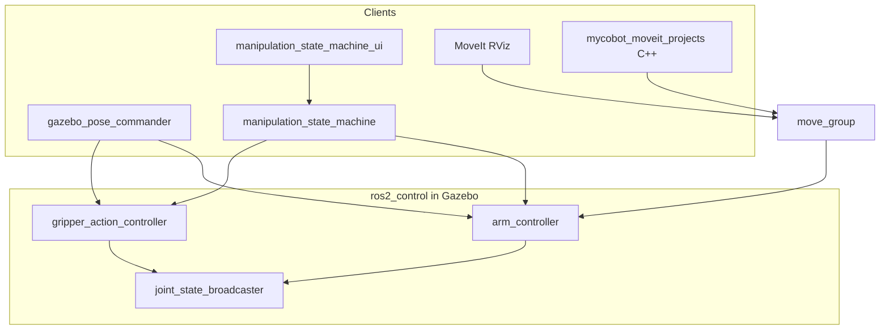
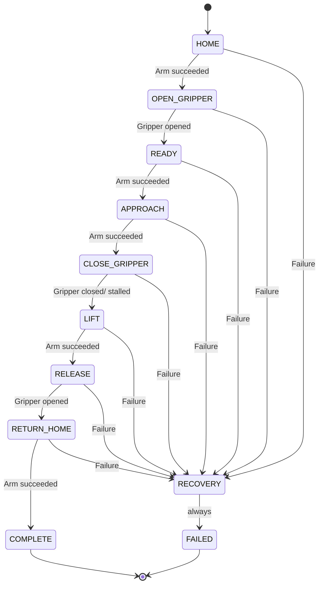

# myCobot 280 JN — Simulation Workspace

ROS 2 Humble workspace for the Elephant Robotics myCobot 280 Jetson Nano with adaptive gripper: RViz learning demos, Gazebo physics, hand-tuned pick-and-place, MoveIt 2 planning, and C++ MoveIt exercises.

**Environment:** Ubuntu host + Docker container `mycobot-humble`. Workspace bind-mount: `/home/raj/mycobot_ws` ↔ `/root/mycobot_ws`.

**Always inside Docker before any ROS command:**

```bash
source /opt/ros/humble/setup.bash
source /root/mycobot_ws/install/setup.bash
```

Docker setup, X11, and host-vs-container rules: [myCobot_280_JN_Docker_Simulation_Guide.md](myCobot_280_JN_Docker_Simulation_Guide.md).

---

## Table of contents

1. [Which tool should I use?](#which-tool-should-i-use)
2. [Packages](#packages)
3. [Architecture](#architecture)
4. [Build](#build)
5. [Quick-start workflows](#quick-start-workflows)
6. [All commands reference](#all-commands-reference)
7. [State machine (theory + usage)](#state-machine-theory--usage)
8. [Pick-cube (calibrated grasp)](#pick-cube-calibrated-grasp)
9. [MoveIt 2](#moveit-2)
10. [Controllers and action servers](#controllers-and-action-servers)
11. [Theory document map](#theory-document-map)
12. [Learning path](#learning-path)
13. [Changelog](#changelog)
14. [Documentation index](#documentation-index)
15. [Remember for the future](#remember-for-the-future)
16. [Troubleshooting](#troubleshooting)

---

## Which tool should I use?

| Goal | Use this | Not this |
|------|----------|----------|
| Pick the 25 mm cube reliably | `gazebo_pose_commander -- pick_cube` | `manipulation_state_machine` (generic poses) |
| Learn state machines visually | `manipulation_state_machine_ui` | — |
| Plan collision-aware paths in RViz | MoveIt `gazebo_move_group` + RViz | Raw joint publishing |
| Move to SRDF named states from C++ | `mycobot_moveit_projects named_targets` | — |
| Cartesian descend demo (FK→IK→OMPL) | `mycobot_moveit_projects pose_target` | — |
| Add table/cube to MoveIt planning scene | `planning_scene_objects` | — |
| Test obstacle blocking at grasp pose | `test_obstacle` | — |
| URDF learning without physics | `display_rviz.launch.py` | Gazebo |
| Manual joint jog | `keyboard_control` | — |

**Rule of thumb:** `gazebo_pose_commander.py` owns **all calibrated pick logic**. `manipulation_state_machine.py` is a **generic demo template** with its own poses.

---

## Packages

| Package | Purpose | Key files |
|---------|---------|-----------|
| [`mycobot_ros2/`](mycobot_ros2/) | Upstream Elephant Robotics (`humble` branch) | Slider GUIs, descriptions |
| [`mycobot_280jn_sim/`](mycobot_280jn_sim/) | Gazebo sim | `gazebo_sim.launch.py`, `mycobot_table.sdf`, `controllers.yaml`, URDF |
| [`mycobot_sim_projects/`](mycobot_sim_projects/) | Python nodes + theory | `gazebo_pose_commander.py`, `manipulation_state_machine*.py`, `THEORY.md` |
| [`mycobot_280jn_moveit_config/`](mycobot_280jn_moveit_config/) | MoveIt 2 config | SRDF, OMPL, `gazebo_move_group.launch.py` |
| [`mycobot_moveit_projects/`](mycobot_moveit_projects/) | C++ MoveIt demos | `named_targets`, `pose_target`, `planning_scene_objects`, `test_obstacle` |

---

## Architecture



**Action servers (shared by all arm/gripper clients):**

| Server | Type |
|--------|------|
| `/arm_controller/follow_joint_trajectory` | `control_msgs/action/FollowJointTrajectory` |
| `/gripper_action_controller/gripper_cmd` | `control_msgs/action/GripperCommand` |

**Two control paths:**

| Path | Nodes | Physics |
|------|-------|---------|
| **Sim / ros2_control** | `gazebo_pose_commander`, FSM, MoveIt | Real Gazebo physics |
| **RViz-only** | `pose_sequence`, `keyboard_control` | Publishes `/joint_states` directly (no physics) |

---

## Build

```bash
cd /root/mycobot_ws
colcon build --packages-select \
  mycobot_280jn_sim \
  mycobot_sim_projects \
  mycobot_280jn_moveit_config \
  mycobot_moveit_projects
source install/setup.bash
```

Rebuild after editing any of those packages. **Full Gazebo restart** required after world/URDF changes.

Verify cube size in install tree:

```bash
grep "Cube size" install/mycobot_280jn_sim/share/mycobot_280jn_sim/worlds/mycobot_table.sdf
# Expected: 0.025 m (25 mm)
```

---

## Quick-start workflows

### A — Gazebo + cube pick (primary demo)

```bash
# Terminal 1
ros2 launch mycobot_280jn_sim gazebo_sim.launch.py

# Terminal 2
ros2 run mycobot_sim_projects gazebo_pose_commander -- pick_cube
```

### B — Gazebo + state machine UI

```bash
# Host first
xhost +local:docker

# Terminal 1 — Gazebo (as above)

# Terminal 2
ros2 run mycobot_sim_projects manipulation_state_machine_ui
```

### C — Gazebo + MoveIt (plan in RViz)

```bash
# Terminal 1 — Gazebo

# Terminal 2
ros2 launch mycobot_280jn_moveit_config gazebo_move_group.launch.py

# Terminal 3
ros2 launch mycobot_280jn_moveit_config gazebo_moveit_rviz.launch.py
```

In RViz: group **arm** → target **grasp_approach** → Plan & Execute.

Optional — sync MoveIt planning scene with Gazebo objects:

```bash
ros2 run mycobot_moveit_projects planning_scene_objects
```

### D — Gazebo + MoveIt C++ demos

```bash
# Terminals 1–2 as in workflow C, then:

ros2 launch mycobot_moveit_projects named_targets.launch.py
# or
ros2 launch mycobot_moveit_projects pose_target.launch.py
```

### E — RViz only (no Gazebo)

```bash
ros2 launch mycobot_sim_projects display_rviz.launch.py
ros2 run mycobot_sim_projects pose_sequence
```

---

## All commands reference

### Gazebo + sim (`mycobot_280jn_sim`, `mycobot_sim_projects`)

| Command | Purpose |
|---------|---------|
| `ros2 launch mycobot_280jn_sim gazebo_sim.launch.py` | Gazebo + robot + controllers |
| `ros2 run mycobot_sim_projects gazebo_pose_commander -- pick_cube` | **Full calibrated pick** |
| `ros2 run mycobot_sim_projects gazebo_pose_commander -- <pose>` | Single pose (`home`, `grasp_approach`, `grasp_hover`, …) |
| `ros2 run mycobot_sim_projects gripper_commander -- open\|close\|wide` | Gripper only |
| `ros2 run mycobot_sim_projects manipulation_state_machine` | Generic FSM (CLI) |
| `ros2 run mycobot_sim_projects manipulation_state_machine_ui` | Generic FSM (GUI) |
| `ros2 run mycobot_sim_projects keyboard_control` | Keyboard joint jog |
| `ros2 run mycobot_sim_projects pose_sequence` | Smooth pose cycle |
| `ros2 run mycobot_sim_projects joint_monitor` | Joint limit warnings |
| `ros2 run mycobot_sim_projects tf_explorer` | Print gripper TF |
| `ros2 launch mycobot_sim_projects display_rviz.launch.py` | RViz URDF demo |

**`gazebo_pose_commander` useful flags:** `--duration 5.0` (seconds per arm move)

**Available poses** (single-pose mode): `home`, `ready`, `observe`, `left_ready`, `grasp_approach`, `grasp_hover`, `grasp_descend`, `grasp_lift`, `grasp_retract`, `grasp`, plus legacy `pick_*` and `top_pick_*` aliases. Use `pick_cube` for the full calibrated sequence.

**FSM useful flags:** `--arm-duration 5.0`, `--pause 0.5`

### MoveIt (`mycobot_280jn_moveit_config`, `mycobot_moveit_projects`)

| Command | Purpose |
|---------|---------|
| `ros2 launch mycobot_280jn_moveit_config gazebo_move_group.launch.py` | Planning server |
| `ros2 launch mycobot_280jn_moveit_config gazebo_moveit_rviz.launch.py` | RViz MotionPlanning |
| `ros2 launch mycobot_moveit_projects named_targets.launch.py` | C++: `home` → `grasp_approach` → `home` |
| `ros2 launch mycobot_moveit_projects pose_target.launch.py` | C++: approach → Z−3 cm → home |
| `ros2 run mycobot_moveit_projects planning_scene_objects` | Add table + cube to planning scene |
| `ros2 run mycobot_moveit_projects test_obstacle --ros-args -p operation:=add` | Add blocking box at grasp pose |
| `ros2 run mycobot_moveit_projects test_obstacle --ros-args -p operation:=remove` | Remove test obstacle |

Details: [mycobot_moveit_projects/README.md](mycobot_moveit_projects/README.md).

---

## State machine (theory + usage)

Full theory: [THEORY.md — manipulation_state_machine.py](mycobot_sim_projects/THEORY.md#manipulation_state_machinepy--pick-and-place-state-machine).

### What it does

Chains arm + gripper action servers into one **blocking** pick/place demo. Each state runs exactly one action, waits for the result, then transitions. This teaches the **sequencing pattern** used by `pick_cube`, but with **generic poses** not tuned for the 25 mm cube.

**Important:** Calibrated grasp logic lives only in `gazebo_pose_commander.py` (`pick_cube`, `grasp_*` poses). The FSM keeps its own local `ARM_POSES` (`home` / `ready` / `approach` / `lift`) and must not be used for reliable cube picking.

### Theory: sequencing layer (not new motion math)

Each individual arm or gripper move uses the same interpolation and action-handshake model as `gazebo_pose_commander.py` and `gripper_commander.py`. What is new is the **sequencing layer** on top:

| Concept | Behaviour |
|---------|-----------|
| **Blocking chain** | One action per state; `transition()` only runs after `spin_until_future_complete` returns success or failure — steps never overlap |
| **Uniform failure path** | Every failed `move_arm` / `move_gripper` calls `fail()` → `RECOVERY`; no per-state bespoke error handling |
| **RECOVERY is terminal** | Best-effort open + home (return values ignored), then always → `FAILED`; no retry |
| **Gripper stall = success** | On `CLOSE_GRIPPER`, `reached_goal` **or** `stalled` counts as success — stalling against an object is the intended grasp outcome (see controllers section) |

Formal state set:

```
S = {HOME, OPEN_GRIPPER, READY, APPROACH, CLOSE_GRIPPER, LIFT,
     RELEASE, RETURN_HOME, COMPLETE, RECOVERY, FAILED}
```

Transition rule for the eight happy-path states:

```
S(k+1) = next_state   if the state's action succeeds
S(k+1) = RECOVERY     if the state's action fails
```

`RECOVERY` always → `FAILED`. `COMPLETE` and `FAILED` are terminal.

### State flow

```
HOME → OPEN_GRIPPER → READY → APPROACH → CLOSE_GRIPPER
     → LIFT → RELEASE → RETURN_HOME → COMPLETE
```

On any failure → **RECOVERY** (best-effort open + home) → **FAILED** (terminal, no retry).



### State table

| State | Action | On success → | On failure → |
|-------|--------|--------------|--------------|
| `HOME` | `move_arm("home")` | `OPEN_GRIPPER` | `RECOVERY` |
| `OPEN_GRIPPER` | gripper open (0.0 rad) | `READY` | `RECOVERY` |
| `READY` | `move_arm("ready")` | `APPROACH` | `RECOVERY` |
| `APPROACH` | `move_arm("approach")` | `CLOSE_GRIPPER` | `RECOVERY` |
| `CLOSE_GRIPPER` | gripper close (−0.5 rad) | `LIFT` | `RECOVERY` |
| `LIFT` | `move_arm("lift")` | `RELEASE` | `RECOVERY` |
| `RELEASE` | gripper open | `RETURN_HOME` | `RECOVERY` |
| `RETURN_HOME` | `move_arm("home")` | `COMPLETE` | `RECOVERY` |
| `RECOVERY` | open + home (best effort, results ignored) | `FAILED` | `FAILED` |
| `COMPLETE` | terminal — `run()` returns `True` | — | — |
| `FAILED` | terminal — logs `failed_state`, `run()` returns `False` | — | — |

### FSM vs `pick_cube`

| | `manipulation_state_machine` | `gazebo_pose_commander pick_cube` |
|--|------------------------------|-----------------------------------|
| Poses | Generic `home/ready/approach/lift` | FK-tuned `grasp_*` for 25 mm cube |
| Gripper close | Waits for action result | 3 s timeout + `proceed_on_timeout` |
| Lift | Single `lift` pose | Staged `grasp_lift` → `grasp_retract` |
| Purpose | Learn FSM pattern | Reliable sim pick |

### UI (`manipulation_state_machine_ui`)

Same FSM class, Tkinter front-end — **no duplicate FSM logic**. Theory: [THEORY.md — UI layer](mycobot_sim_projects/THEORY.md#ui-layer-manipulation_state_machine_uipy).

**Architecture:** FSM runs in a **background thread**; a `MultiThreadedExecutor` spins the ROS node; the main thread polls `node.state` every 200 ms to repaint the state strip.

**State strip** (`TASK_FLOW` order): gray = pending, yellow = current, green = completed, red = failed state, orange = entire strip during `RECOVERY`.

| Control | Effect |
|---------|--------|
| **Start sequence** | `reset()` then `run()` in worker thread |
| **Stop** | `request_stop()` — checked at start of each loop iteration; current action finishes first |
| **Reset** | `reset()` to `HOME` (disabled while running) |

Timing spinboxes map to `--arm-duration` and `--pause`. Requires `DISPLAY` (`xhost +local:docker` on host). Does **not** run `pick_cube`.

**Run:**

```bash
ros2 run mycobot_sim_projects manipulation_state_machine_ui
# CLI equivalent (no GUI):
ros2 run mycobot_sim_projects manipulation_state_machine
```

---

## Pick-cube (calibrated grasp)

**File:** [`gazebo_pose_commander.py`](mycobot_sim_projects/mycobot_sim_projects/gazebo_pose_commander.py)  
**Target:** 25 mm cube at world `(0.20, 0.00, 0.4125)` — [`mycobot_table.sdf`](mycobot_280jn_sim/worlds/mycobot_table.sdf)

**Sequence:**

```
open → grasp_approach → grasp_hover → grasp_descend
     → close → hold 0.8 s → grasp_lift → grasp_retract
```

**Design rules:**

- Top-down wrist: `joint1 ≈ 0.330216`; only `j2`–`j4` change for vertical motion
- Descend stops **above** cube; close achieves grasp
- Lift mirrors descend (hover then retract) — never jump descend → approach in one move
- Gripper close: −0.55 rad, 8 N, 3 s timeout with proceed-on-timeout

| Issue fixed | Solution |
|-------------|----------|
| XY offset | `joint1 ≈ 0.33` for top-down |
| Cube too big | 40 mm → 25 mm |
| World not updating | CMake real-copy install |
| Gripper too high | FK retune descend TCP ~54 mm |
| Table collision | Staged approach → hover → descend |
| No lift | Two-stage lift |
| Hang after close | Gripper timeout |

Full joint values and tuning: [PICK_CUBE_HANDOFF.md](mycobot_sim_projects/PICK_CUBE_HANDOFF.md).

---

## MoveIt 2

MoveIt adds IK, collision checking, and OMPL planning on top of the same `arm_controller`.

### SRDF named states

| Name | Source |
|------|--------|
| `home` | All joints zero |
| `grasp_approach` | Copied from tuned `gazebo_pose_commander` pose |

Config: [`mycobot_280jn_sim.srdf`](mycobot_280jn_moveit_config/config/mycobot_280jn_sim.srdf)

### SRDF collision exemptions (mesh false positives)

| Pair | Why |
|------|-----|
| `gripper_base` ↔ `joint2`, `joint3` | Goal `grasp_approach` flagged in collision |
| `gripper_right1` ↔ `gripper_right2` | Path validation failed along trajectory |

If planning fails with new collision pairs, add matching `<disable_collisions>` entries in the SRDF.

### C++ nodes summary

| Node | What it demonstrates |
|------|---------------------|
| `named_targets` | SRDF joint targets → OMPL → execute |
| `pose_target` | FK read TCP → Z−3 cm → IK → OMPL → execute |
| `planning_scene_objects` | Add table + cube boxes to MoveIt scene (world frame) |
| `test_obstacle` | Add/remove 10 cm box blocking grasp path |

Pose-target pipeline:

```
joint_states → FK → TCP pose → offset Z −3 cm → IK → OMPL → arm_controller
```

Deep theory: [THEORY.md — MoveIt](mycobot_sim_projects/THEORY.md#moveit-integration-mycobot_280jn_moveit_config--in-progress).

---

## Controllers and action servers

Config: [`mycobot_280jn_sim/config/controllers.yaml`](mycobot_280jn_sim/config/controllers.yaml)

| Controller | Joints | Notes |
|------------|--------|-------|
| `joint_state_broadcaster` | 6 arm + `gripper_controller` | Publishes `/joint_states` |
| `arm_controller` | 6 arm joints | `FollowJointTrajectory` |
| `gripper_action_controller` | `gripper_controller` | `GripperCommand`; `allow_stalling: true`, `stall_timeout: 1.0` |

Gripper stall-on-object is **expected** during close — both `pick_cube` and the FSM rely on it.

Theory: [THEORY.md — controllers.yaml sections](mycobot_sim_projects/THEORY.md#controllersyaml--mycobot-arm-trajectory-controller).

---

## Theory document map

All deep “why” documentation lives in [`mycobot_sim_projects/THEORY.md`](mycobot_sim_projects/THEORY.md):

| # | Node / topic | THEORY section |
|---|--------------|----------------|
| 01 | `pose_sequence.py` | Smooth lerp sequencer |
| 02 | `keyboard_control.py` | Keyboard jog |
| 03 | `joint_monitor.py` | Safety monitor |
| 04 | `tf_explorer.py` | FK / TF |
| 05 | `gazebo_pose_commander.py` | Trajectory commander + **pick_cube** |
| 06 | `gripper_commander.py` | Gripper actions |
| 07 | `manipulation_state_machine.py` | **FSM + UI** |
| — | `pick_cube` world model | Grasp target geometry |
| — | MoveIt config | Planning vs hand-tuned poses |
| — | Docker restart | Re-source after container restart |

---

## Learning path

| Step | Topic | Status | Command / package |
|------|-------|--------|-------------------|
| 1 | URDF in RViz | Done | `display_rviz.launch.py` |
| 2 | Slider / keyboard | Done | upstream + `keyboard_control` |
| 3 | `/joint_states` + TF | Done | `joint_monitor`, `tf_explorer` |
| 4 | Python pose nodes | Done | `pose_sequence`, `gazebo_pose_commander` |
| 5 | Gazebo + ros2_control | Done | `mycobot_280jn_sim` |
| 6 | State machines | Done | `manipulation_state_machine`, `_ui` |
| 7 | Fixed-position pick | Done | `pick_cube` |
| 8 | MoveIt planning | In progress | MoveIt RViz + C++ nodes |
| 9 | Planning scene objects | Started | `planning_scene_objects`, `test_obstacle` |
| 10+ | Cameras, ML, RL | Not started | — |

---

## Changelog

- **Gazebo sim** (`mycobot_280jn_sim`): table world, 25 mm dynamic cube, adaptive gripper URDF, ros2_control
- **Pick** (`gazebo_pose_commander.py`): FK-calibrated top-down poses, staged lift, gripper timeouts
- **World install**: CMake real-copy fix for Docker/host symlink breakage
- **MoveIt** (`mycobot_280jn_moveit_config`): Setup Assistant + Gazebo-linked launches
- **SRDF**: self-collision exemptions for gripper/arm mesh overlaps
- **C++ MoveIt** (`mycobot_moveit_projects`): named targets, pose target, planning scene, test obstacle
- **FSM UI** (`manipulation_state_machine_ui.py`): Tkinter control panel
- **Docs**: this README, THEORY.md, PICK_CUBE_HANDOFF.md, Docker guide §12–14

---

## Documentation index

| Document | Contents |
|----------|----------|
| [README.md](README.md) | This file — workspace hub |
| [myCobot_280_JN_Docker_Simulation_Guide.md](myCobot_280_JN_Docker_Simulation_Guide.md) | Docker, X11, host commands |
| [mycobot_sim_projects/THEORY.md](mycobot_sim_projects/THEORY.md) | Full control theory per node |
| [mycobot_sim_projects/PICK_CUBE_HANDOFF.md](mycobot_sim_projects/PICK_CUBE_HANDOFF.md) | Pick-cube tuning history + joint values |
| [mycobot_moveit_projects/README.md](mycobot_moveit_projects/README.md) | C++ MoveIt node details |

---

## Remember for the future

These rules prevent the most common repeat mistakes:

1. **Always source inside Docker** before any ROS command (`/opt/ros/humble` + workspace `install/setup.bash`).
2. **Gazebo first** — every sim node, FSM, and MoveIt client needs `gazebo_sim.launch.py` running with active controllers.
3. **`pick_cube` ≠ FSM** — calibrated grasp is only in `gazebo_pose_commander.py`; the state machine is a generic teaching demo.
4. **Rebuild + full Gazebo restart** after URDF, world, or controller YAML changes; verify cube size with `grep "Cube size"` in install.
5. **MoveIt needs two terminals** — `gazebo_move_group.launch.py` then RViz or C++ demo; they are separate launches.
6. **SRDF collision pairs** — if MoveIt reports goal-in-collision or invalid path, read the logged link pair and add `<disable_collisions>` in the SRDF (mesh false positives are normal).
7. **Host file permissions** — Docker-generated files may be `nobody`; `chown` before editing on the host.
8. **X11 for GUI** — RViz and FSM UI need `xhost +local:docker` on the host and a running `DISPLAY`.
9. **Gripper stall is OK** — closing on an object triggers `stalled`; both `pick_cube` and the FSM treat that as success.
10. **Stop is between states** — FSM Stop waits for the current arm/gripper action to finish before exiting.

---

## Troubleshooting

| Symptom | Likely cause | Fix |
|---------|--------------|-----|
| Cube still 40 mm in Gazebo | Stale world / symlink | Rebuild `mycobot_280jn_sim`, restart Gazebo, `grep "Cube size"` in install |
| `EACCES` saving files on host | Docker created files as `nobody` | `sudo chown -R $USER:$USER ~/mycobot_ws/src/<package>` |
| Pick hangs after gripper close | Old `mycobot_sim_projects` install | Rebuild; needs close timeout fix |
| MoveIt: goal in collision | SRDF mesh overlap | Add `disable_collisions` (see MoveIt section) |
| MoveIt: invalid path along trajectory | Gripper link pairs | Same — check move_group log for pair names |
| MoveIt: no planning scene objects | Scene not synced | Run `planning_scene_objects` |
| FSM / pick: controller unavailable | Gazebo not running or controllers not spawned | Launch `gazebo_sim.launch.py` first |
| RViz / UI won't open | No DISPLAY | `xhost +local:docker` on host |
| Stale packages after container restart | Old sourced environment | Re-source both setup.bash files |
| `pick_cube` misses cube | Cube knocked over | Reset sim; check cube with `ign model -m pick_cube --pose` |
| FSM Stop seems slow | Stop checked between states only | Current arm/gripper action must finish first |

**Diagnostic commands:**

```bash
ros2 node list
ros2 action list | grep -E 'arm|gripper'
ros2 topic echo /joint_states --once
ign model -m pick_cube --pose
```
