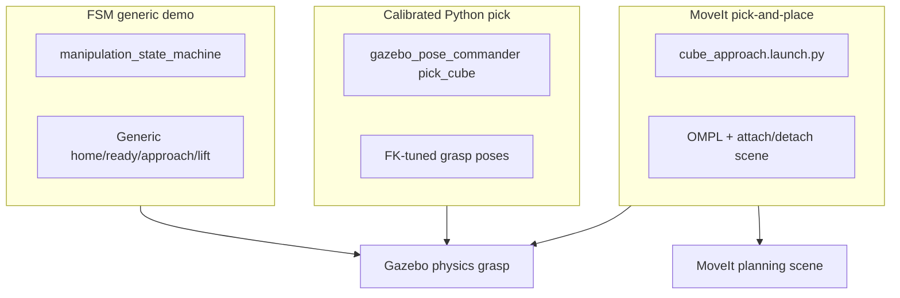
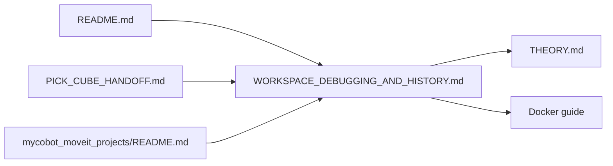

# Workspace Debugging & History

Master handoff for the myCobot 280 JN Gazebo + MoveIt workspace: architecture, state machine, every major bug we hit, fixes applied, and how to run things reliably.

**Related docs:** [README.md](README.md) (hub), [PICK_CUBE_HANDOFF.md](mycobot_sim_projects/PICK_CUBE_HANDOFF.md) (pick tuning), [mycobot_moveit_projects/README.md](mycobot_moveit_projects/README.md) (MoveIt nodes), [THEORY.md](mycobot_sim_projects/THEORY.md) (full control theory).

---

## 1. Three pick paths (do not mix)



| Path | Entry point | Planning | Grasp | Best for |
|------|-------------|----------|-------|----------|
| **FSM** | `manipulation_state_machine` / `_ui` | None (joint targets) | Generic poses | Learning state machines |
| **pick_cube** | `gazebo_pose_commander -- pick_cube` | None (FK-tuned poses) | Gazebo physics only | Reliable sim pick (single command) |
| **cube_approach** | `cube_approach.launch.py` | MoveIt OMPL + Cartesian; attach/detach | Physics + MoveIt + **vision** | Full MoveIt vision pick-and-place |

**Rule:** FSM ≠ pick_cube ≠ cube_approach. Do not use FSM poses for the 25 mm cube. Do not launch multiple Gazebo stacks. Do not run `gazebo_sim.launch.py` and `gazebo_moveit_stack.launch.py` at the same time.

---

## 2. State machine (condensed)

Full theory: [README.md — State machine](README.md#state-machine-theory--usage) and [THEORY.md — manipulation_state_machine](mycobot_sim_projects/THEORY.md#manipulation_state_machinepy--pick-and-place-state-machine).

### Happy path

```
HOME → OPEN_GRIPPER → READY → APPROACH → CLOSE_GRIPPER
     → LIFT → RELEASE → RETURN_HOME → COMPLETE
```

Any action failure → **RECOVERY** (best-effort open + home) → **FAILED** (terminal, no retry).

### Key behaviour

| Concept | Detail |
|---------|--------|
| Blocking chain | One arm or gripper action per state; next state only after result |
| Gripper stall = success | On `CLOSE_GRIPPER`, `reached_goal` or `stalled` counts as success (same idea as `pick_cube`) |
| Generic poses | `ARM_POSES`: `home`, `ready`, `approach`, `lift` — **not** calibrated for 25 mm cube |
| UI | FSM in background thread; `MultiThreadedExecutor` for ROS; Stop checked between states only |

### FSM vs pick_cube vs cube_approach

| | FSM | pick_cube | cube_approach |
|--|-----|-----------|---------------|
| Poses | Generic | FK-tuned `grasp_*` | SRDF `grasp_*` + IK place |
| Close gripper | Wait for result | 3 s timeout, proceed on stall | 3 s timeout, proceed on stall |
| Lift | Single `lift` | Staged hover → approach | Staged hover → approach |
| MoveIt scene | No | No | Yes (table, attach, detach) |

---

## 3. Debugging encyclopedia

### Gazebo / Docker

| Symptom | Root cause | Fix |
|---------|------------|-----|
| `Authorization required` / `could not connect to display :1` | X11 not forwarded into Docker | Host: `xhost +local:docker`. Container: `docker exec -it -e DISPLAY="$DISPLAY" mycobot-humble bash` |
| Gazebo GUI aborts, controllers hang | Server died when GUI failed | Fix X11 first; restart Gazebo |
| `Failed to find plugin [gz-physics-dartsim-plugin]` | Bad local edit to world file | Use **`ignition-physics-dartsim-plugin`** in `mycobot_table.sdf` |
| Segfault at controller load | Wrong physics plugin and/or `update_rate: 250` | Revert world + `controllers.yaml` to **`update_rate: 100`**; rebuild; full restart |
| Cube still 40 mm in sim | Stale install / broken symlinks | Rebuild `mycobot_280jn_sim`; CMake real-copy of world; `grep "0.025"` in install tree; full Gazebo restart |
| Real-Time Factor ~4% in GUI during grasp | Mesh finger collisions + contact solving + Docker/GUI load | Expected under load; RTF recovers when idle. Not the same as broken `/clock` |
| `libGL error` / `failed to create drawable` | GPU/X11 in Docker | Sim may still run; use X11 forwarding; GUI may be slow |

### Sim time / ROS graph

| Symptom | Root cause | Fix |
|---------|------------|-----|
| `/clock` **Publisher count: 3**, hz ~1500 | Three `gazebo_sim.launch.py` instances (three `clock_bridge` nodes) | Nuclear cleanup (below); launch **one** stack only |
| Healthy `/clock` | Single Gazebo | **Publisher count: 1**, hz ~**500** (matches `max_step_size: 0.002`) |
| `Detected jump back in time` (TF) | Gazebo restarted while `move_group` still running | Stop all; restart Gazebo + move_group together |
| MoveIt execute aborted | Same — stale sim time | Use `gazebo_moveit_stack.launch.py` or restart both |
| `No simulation clock received` | Gazebo not running or no bridge | Launch `gazebo_sim.launch.py` or combined stack; check `ros2 topic hz /clock` |

### MoveIt / cube_approach

| Symptom | Root cause | Fix |
|---------|------------|-----|
| Hangs after "Loading robot model…" | `move_group` not running | Launch `gazebo_moveit_stack.launch.py` or `gazebo_move_group.launch.py` first |
| "Gripper is not at its open preset" | Gripper closed at start | `ros2 run mycobot_sim_projects gripper_commander -- open` |
| Planning fails at pick location | Wrong cube Z in scene | MoveIt `world` = robot base: cube centre Z **0.0075**, not Gazebo Z 0.4125 |
| Carry path ignores cube vs table | No attach in scene (old code) | `cube_approach` now attaches after close, detaches before open |
| `No cube detection received within 10 seconds` | Vision not running | Launch `cube_approach.launch.py` (includes vision) or `color_cube_detector` + `pixel_to_world`; verify `/selected_cube/world_center` |
| `planning_scene_objects` confusion | Optional manual tool | `cube_approach` adds `work_table` automatically; run `planning_scene_objects` only for manual scene setup |

### Vision / color pick

| Symptom | Root cause | Fix |
|---------|------------|-----|
| `No executable found` (color_cube_detector) | Missing `setup.py` entry or stale build | `colcon build --packages-select mycobot_sim_projects`; source install |
| Robot goes to red when detecting blue | `target_color:=red` or two detectors on `/selected_cube/pixel_center` | `target_color:=blue`; run **one** detector; verify `Vision cube position: y≈-0.10` |
| `pixel_to_world` silent | No `/overhead_camera/camera_info` yet | Wait for Gazebo camera bridge; `ros2 topic hz /overhead_camera/camera_info` |
| Wrong XY after camera move | Stale world install | Rebuild `mycobot_280jn_sim`; full Gazebo restart; `pixel_to_world.py` defaults must match SDF camera pose |

### Gripper / collision

| Symptom | Root cause | Fix |
|---------|------------|-----|
| Fingers pass through cube | Box finger collisions + soft gain 0.25 | Mesh finger collisions + `position_proportional_gain: 1.0` in URDF; rebuild + restart |
| Gain still 0.1 in Gazebo log | Install tree not rebuilt | `colcon build --packages-select mycobot_280jn_sim`; full Gazebo restart |
| Slow sim after mesh change | Mesh–mesh contact cost | Tradeoff: mesh = accurate contact; boxes = faster but penetration |
| `gripper_base` | Mesh collision heavy | Box collision `0.08×0.06×0.04` (visual mesh unchanged) |

---

## 4. Do NOT reintroduce

- `gz-physics-dartsim-plugin` in world file (use `ignition-physics-dartsim-plugin`)
- `update_rate: 250` in `controllers.yaml` without matching sim step tuning
- `position_proportional_gain: 0.25` (fingers phase through objects)
- Multiple concurrent Gazebo / `gazebo_sim.launch.py` runs
- Using **FSM** for calibrated 25 mm cube pick
- Mixing Gazebo global coordinates into MoveIt planning scene without conversion

---

## 5. Code and config changes (summary)

| File | Change |
|------|--------|
| `mycobot_280jn_sim/urdf/mycobot_280jn_sim.urdf.xacro` | `gripper_base` box collision; finger **mesh** collisions; `position_proportional_gain: 1.0` |
| `mycobot_moveit_projects/src/cube_approach.cpp` | Planning scene: table at start; attach cube after close; detach + place before open |
| `mycobot_moveit_projects/src/planning_scene_objects.cpp` | Cube Z fixed to **0.0075** (MoveIt `world` frame) |
| `mycobot_280jn_sim/worlds/mycobot_table.sdf` | Camera (0.30, -0.25, 1.30); `green_cube`, `blue_cube` models |
| `color_cube_detector.py` | Multi-color HSV detection → `/selected_cube/pixel_center` |
| `pixel_to_world.py` | `/selected_cube/*` topics; camera defaults 0.30, -0.25, 0.895 |
| `cube_approach.cpp` | `/selected_cube/world_center`; vision-relative descent |
| `cube_approach.launch.py` | Bundles vision + `target_color` launch arg |
| `setup.py` | `color_cube_detector` console script entry point |
| `README.md` | Vision section, learning path steps 14–15, troubleshooting |

### cube_approach sequence (current)

```
wait /selected_cube/world_center
  → approach (vision XY) → vision hover → vision pre-grasp
  → close → attach pick_cube to gripper_tcp
  → lift → carry → place descend
  → detach cube → open → retract → home
```

---

## 6. Frame reference (Gazebo vs MoveIt)

MoveIt `world` = robot base (`joint1`). Gazebo world Z **minus 0.405 m** for horizontal positions; cube centre Z **0.0075 m** in MoveIt (table top + half cube).

| Model | Gazebo centre (x, y, z) | MoveIt `world` (x, y, z) |
|-------|-------------------------|---------------------------|
| `pick_cube` (red) | (0.15, 0.10, 0.4125) | (0.15, 0.10, 0.0075) |
| `green_cube` | (0.20, 0.00, 0.4125) | (0.20, 0.00, 0.0075) |
| `blue_cube` | (0.15, -0.10, 0.4125) | (0.15, -0.10, 0.0075) |
| `overhead_camera` | (0.30, -0.25, 1.30) | (0.30, -0.25, 0.895) |

Always use **0.0075** for cube Z in MoveIt collision objects and vision output.

---

## 7. Standard operating procedure

### Host

```bash
xhost +local:docker
docker exec -it -e DISPLAY="$DISPLAY" mycobot-humble bash
```

### Container — before every MoveIt pick

```bash
source /opt/ros/humble/setup.bash
source ~/mycobot_ws/install/setup.bash

# Must be 1 before proceeding
ros2 topic info /clock -v | grep "Publisher count"
```

### Clean shutdown (if multiple Gazebo or stale processes)

```bash
pkill -9 -f "ros2 launch" || true
pkill -9 -f "ign gazebo" || true
pkill -9 -f "gz sim" || true
pkill -9 -f gzserver || true
pkill -9 -f parameter_bridge || true
pkill -9 -f clock_bridge || true
pkill -9 -f move_group || true

ros2 daemon stop
ros2 daemon start
```

### Single stack (recommended for cube_approach)

```bash
ros2 launch mycobot_280jn_moveit_config gazebo_moveit_stack.launch.py
```

Wait ~15 s for Gazebo + controllers + move_group.

### Prepare arm + run vision pick-and-place

```bash
ros2 run mycobot_sim_projects gripper_commander -- open
ros2 launch mycobot_moveit_projects cube_approach.launch.py target_color:=blue
```

Launch file starts `color_cube_detector` + `pixel_to_world`, then `cube_approach` after 2 s.

Manual vision (if not using bundled launch):

```bash
ros2 run mycobot_sim_projects color_cube_detector \
  --ros-args -p target_color:=blue -p use_sim_time:=true
ros2 run mycobot_sim_projects pixel_to_world --ros-args -p use_sim_time:=true
ros2 topic echo /selected_cube/world_center --once
ros2 launch mycobot_moveit_projects cube_approach.launch.py
```

### Python pick only (no MoveIt)

```bash
ros2 launch mycobot_280jn_sim gazebo_sim.launch.py
# second terminal:
ros2 run mycobot_sim_projects gazebo_pose_commander -- pick_cube
```

### After URDF / world / controller changes

```bash
colcon build --packages-select mycobot_280jn_sim mycobot_280jn_moveit_config mycobot_moveit_projects
source ~/mycobot_ws/install/setup.bash
# full Gazebo kill + restart — partial restart leaves stale models
```

---

## 8. Diagnostic cheat sheet

```bash
# Sim time health
ros2 topic info /clock -v          # Publisher count: 1
ros2 topic hz /clock                 # ~500 Hz good; ~1500 = triple publisher

# Controllers
ros2 action list | grep -E 'arm|gripper'
ros2 topic echo /joint_states --once

# Gazebo cube pose (Gazebo world frame)
ign model -m pick_cube --pose

# Installed URDF gain
grep "position_proportional_gain" \
  ~/mycobot_ws/install/mycobot_280jn_sim/share/mycobot_280jn_sim/urdf/mycobot_280jn_sim.urdf.xacro

# Cube size in install
grep "0.025" \
  ~/mycobot_ws/install/mycobot_280jn_sim/share/mycobot_280jn_sim/worlds/mycobot_table.sdf

# Orphan processes
pgrep -af "ign gazebo|gz sim|gazebo_sim|clock_bridge|move_group"

# Vision pipeline
ros2 topic hz /overhead_camera/image
ros2 topic hz /overhead_camera/camera_info
ros2 topic hz /selected_cube/pixel_center
ros2 topic echo /selected_cube/world_center --once
ros2 run mycobot_sim_projects color_cube_detector \
  --ros-args -p target_color:=blue -p use_sim_time:=true
```

### Interpreting `/clock` hz

| hz (approx) | Meaning |
|-------------|---------|
| ~500 | Healthy single Gazebo (`max_step_size 0.002`) |
| ~100 | Slow sim or decimated clock (investigate RTF) |
| ~950–1500 | Multiple `clock_bridge` publishers — stop extra Gazebo instances |

---

## 9. Documentation map



| Document | Use when |
|----------|----------|
| This file | Debugging, handoff, "what we fixed" |
| [README.md](README.md) | Daily commands, learning path |
| [PICK_CUBE_HANDOFF.md](mycobot_sim_projects/PICK_CUBE_HANDOFF.md) | Python `pick_cube` joint values and tuning |
| [mycobot_moveit_projects/README.md](mycobot_moveit_projects/README.md) | MoveIt node details, launch args |
| [THEORY.md](mycobot_sim_projects/THEORY.md) | Deep dive per Python node |
| [myCobot_280_JN_Docker_Simulation_Guide.md](myCobot_280_JN_Docker_Simulation_Guide.md) | Docker setup, X11, host vs container |
