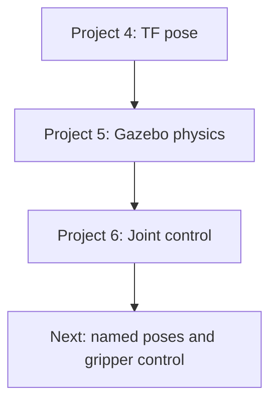
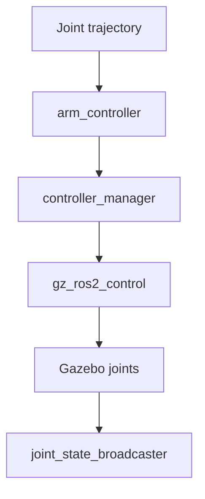

# myCobot 280 Jetson Nano Simulation

## Projects 4, 5 and 6 — Complete Documentation

This document records the simulation work completed for the Elephant Robotics
myCobot 280 Jetson Nano with the adaptive gripper.

The development environment is:

| Component | Version / location |
|---|---|
| Host operating system | Ubuntu 24.04 |
| Host ROS 2 | Jazzy (not used for this Humble project) |
| Docker container | `mycobot-humble` |
| Container operating system | Ubuntu 22.04 |
| Container ROS 2 | Humble |
| Simulator | Gazebo Fortress 6.18 |
| ROS workspace on host | `~/mycobot_ws` |
| ROS workspace in Docker | `/root/mycobot_ws` |

The host workspace is mounted into Docker. Files edited in Cursor on the host
are therefore visible inside the container.

---

# 1. Terminal contexts

Commands must be run in the correct environment.

## Ubuntu host

Host commands include Docker management and opening Cursor:

```bash
xhost +SI:localuser:root

docker start mycobot-humble

docker exec -it \
  -e DISPLAY="$DISPLAY" \
  mycobot-humble bash
```

Open the workspace in Cursor:

```bash
cursor ~/mycobot_ws
```

## ROS 2 Humble container

Every new Docker terminal should source both environments:

```bash
source /opt/ros/humble/setup.bash
source /root/mycobot_ws/install/setup.bash
```

The host uses ROS 2 Jazzy. Running a Humble project command on the host causes
errors such as:

```text
Package 'mycobot_280jn' not found, searching: ['/opt/ros/jazzy']
```

---

# 2. Project overview

| Project | Purpose | Main result |
|---|---|---|
| Project 4 | TF and forward-kinematics explorer | Read the end-effector pose relative to the base |
| Project 5 | Build a physics-ready Gazebo robot | Spawn the robot and table in Gazebo Fortress |
| Project 6 | Add `ros2_control` | Control all six simulated arm joints using trajectories |

The projects form one progression:



---

# 3. Project 4 — TF and end-effector pose explorer

## 3.1 Objective

The purpose of Project 4 was to understand how the pose of the adaptive
gripper is calculated from the six robot joints.

The frames used were:

```text
Base frame:         joint1
End-effector frame: gripper_base
```

## 3.2 Theory

### Coordinate frame

A coordinate frame contains:

- an origin;
- an x-axis;
- a y-axis;
- a z-axis;
- an orientation relative to another frame.

ROS 2 TF stores the spatial relationships between robot frames. The complete
robot forms a TF tree:

```text
joint1
└── joint2
    └── joint3
        └── joint4
            └── joint5
                └── joint6
                    └── joint6_flange
                        └── gripper_base
```

### Forward kinematics

Forward kinematics calculates the end-effector pose from the joint angles:

```text
joint angles q → link transformations → end-effector pose
```

Mathematically, the transformations are multiplied:

```text
T_base_tool = T_1 × T_2 × T_3 × T_4 × T_5 × T_6 × T_tool
```

Each transformation is a 4 × 4 homogeneous matrix:

```text
[ R  p ]
[ 0  1 ]
```

`R` is a 3 × 3 rotation matrix and `p = [x, y, z]` is the translation.

### Quaternion and RPY

The orientation was printed in two forms:

- Quaternion `[x, y, z, w]`: stable for computation and interpolation.
- Roll, pitch and yaw: easier for a human to interpret.

RPY rotations are:

- roll: rotation around x;
- pitch: rotation around y;
- yaw: rotation around z.

## 3.3 Direct TF inspection

With the RViz robot running:

```bash
ros2 run tf2_ros tf2_echo joint1 gripper_base
```

Example result:

```text
Translation: [0.016, 0.101, 0.436]
Quaternion [xyzw]: [0.004, 0.001, 0.259, 0.966]
RPY [degrees]: [0.470, 0.000, 30.000]
```

Interpretation:

- The gripper was 0.016 m along base x.
- It was 0.101 m along base y.
- Its height was 0.436 m along base z.
- Its yaw was approximately 30 degrees.

## 3.4 Custom TF explorer

The custom node reported:

```text
End-effector pose
-----------------
Position [m]: x=-0.046, y=0.001, z=0.436
Quaternion [xyzw]: [0.004, 0.001, 0.301, 0.954]
RPY [degrees]: roll=0.5, pitch=-0.0, yaw=35.0
Distance from base: 0.439 m
Horizontal reach: 0.046 m
Height: 0.436 m
```

The additional values were calculated as:

```text
distance = sqrt(x² + y² + z²)
horizontal reach = sqrt(x² + y²)
height = z
```

Project 4 established the theory needed later for Cartesian planning, inverse
kinematics, MoveIt 2 and camera-to-robot transformations.

---

# 4. Project 5 — Gazebo Fortress physics model

## 4.1 Objective

RViz only visualizes a robot. Project 5 converted the vendor model into a model
that Gazebo could use for physics.

Gazebo requires more information than RViz:

| URDF element | Purpose |
|---|---|
| `<visual>` | Geometry displayed to the user |
| `<collision>` | Geometry used by the physics engine |
| `<inertial>` | Mass, centre of mass and rotational inertia |
| `<joint>` | Mechanical relationship between links |
| `<dynamics>` | Damping and friction |

## 4.2 Vendor model audit

The original adaptive-gripper model was inspected:

```bash
MYCOBOT_URDF=/root/mycobot_ws/src/mycobot_ros2/mycobot_description/urdf/mycobot_280_jn/mycobot_280_jn_adaptive_gripper.urdf

grep -c '<link' "$MYCOBOT_URDF"
grep -c '<inertial' "$MYCOBOT_URDF"
grep -c '<collision' "$MYCOBOT_URDF"

check_urdf "$MYCOBOT_URDF"
```

The original model contained:

```text
14 links
0 inertial elements
7 collision elements
```

It also contained no:

```text
<gazebo>
<transmission>
<ros2_control>
```

Therefore, it was suitable for RViz but incomplete for physics control.

## 4.3 Simulation package

A new package was created:

```text
mycobot_280jn_sim/
├── config/
│   └── controllers.yaml
├── launch/
│   └── gazebo_sim.launch.py
├── meshes/
│   ├── joint5.obj
│   └── joint5.stl
├── urdf/
│   └── mycobot_280jn_sim.urdf.xacro
├── worlds/
│   └── mycobot_table.sdf
├── CMakeLists.txt
└── package.xml
```

Package verification:

```bash
ros2 pkg prefix mycobot_280jn_sim
```

Expected:

```text
/root/mycobot_ws/install/mycobot_280jn_sim
```

## 4.4 Approximate inertia

The vendor did not provide CAD-derived inertial information. An approximate box
inertia macro was created:

```xml
<xacro:macro name="box_inertial" params="mass x y z">
  <inertial>
    <origin xyz="0 0 0" rpy="0 0 0"/>
    <mass value="${mass}"/>
    <inertia
      ixx="${mass * (y * y + z * z) / 12.0}"
      ixy="0.0"
      ixz="0.0"
      iyy="${mass * (x * x + z * z) / 12.0}"
      iyz="0.0"
      izz="${mass * (x * x + y * y) / 12.0}"/>
  </inertial>
</xacro:macro>
```

These estimates make initial simulation possible. They are not accurate enough
for identifying real actuator loads or high-fidelity dynamics. CAD-derived
mass, centre of mass and inertia should eventually replace them.

## 4.5 Collision geometry

Every link was given collision geometry. The final Xacro contained:

```text
14 robot links with visual geometry
14 robot links with collision geometry
14 robot links with inertial definitions
```

Collision geometry affects:

- contact with the table;
- self-collision;
- object grasping;
- physics performance;
- motion-planning collision checks.

Using complex visual meshes as collision meshes is acceptable for an early
prototype but computationally expensive. Later versions should use simplified
boxes, cylinders, capsules or low-poly meshes.

## 4.6 Joint 5 mesh problem

Gazebo Ogre2 could not load the vendor `joint5.dae`:

```text
Cannot load mesh with zero sub-meshes
Failed to get Ogre item for joint5.dae
```

The mesh was converted with Assimp:

```bash
apt install -y assimp-utils

assimp export \
  /root/mycobot_ws/install/mycobot_description/share/mycobot_description/urdf/mycobot_280_jn/joint5.dae \
  /root/mycobot_ws/src/mycobot_280jn_sim/meshes/joint5.stl
```

An OBJ conversion was tested, but its local coordinate transform did not match
the original mesh. This produced a visible gap. The final solution uses the
same STL and origin for both Joint 5 visual and collision geometry:

```xml
<mesh filename="file://$(find mycobot_280jn_sim)/meshes/joint5.stl"/>
```

## 4.7 Resource paths

Gazebo converts many URDF `package://` paths into `model://` paths. Resource
directories were exposed through:

```bash
export IGN_GAZEBO_RESOURCE_PATH=\
/root/mycobot_ws/install/mycobot_description/share:\
${IGN_GAZEBO_RESOURCE_PATH:-}
```

The launch file should set the Gazebo resource paths automatically, so this
does not need to be typed for every session.

## 4.8 World and table

The world contains:

- `ground_plane`;
- `work_table`;
- `sun`;
- `mycobot_280jn`.

Verify:

```bash
ign model --list
```

Expected:

```text
ground_plane
work_table
mycobot_280jn
```

## 4.9 Model spawning

The launch file performs three main operations:

1. Start Gazebo Fortress.
2. Start `robot_state_publisher` with the generated Xacro.
3. Spawn the URDF through `ros_gz_sim create`.

Launch:

```bash
ros2 launch mycobot_280jn_sim gazebo_sim.launch.py
```

## 4.10 Gazebo joint verification

List all robot joints:

```bash
ign model -m mycobot_280jn -j
```

Inspect Joint 5:

```bash
ign model \
  -m mycobot_280jn \
  -j joint5_to_joint4
```

Gazebo detected all six arm joints and six adaptive-gripper joints. The fixed
joint between `joint6_flange` and `gripper_base` was combined during URDF-to-SDF
conversion. This is normal fixed-joint lumping.

## 4.11 Anchoring the base

Initially the whole robot fell over when Gazebo was unpaused. The controllers
controlled the arm joints, but the base was still a free dynamic object.

The model was anchored using:

```xml
<link name="world"/>

<joint name="world_to_joint1" type="fixed">
  <parent link="world"/>
  <child link="joint1"/>
  <origin xyz="0 0 0" rpy="0 0 0"/>
</joint>
```

This fixes the robot base while leaving all six arm joints movable.

Validation now reports `world` as the root link:

```bash
xacro \
  src/mycobot_280jn_sim/urdf/mycobot_280jn_sim.urdf.xacro \
  -o /tmp/mycobot_anchored.urdf

check_urdf /tmp/mycobot_anchored.urdf
```

Expected beginning:

```text
root Link: world
    child: joint1
```

## 4.12 Project 5 validation

```bash
xacro \
  src/mycobot_280jn_sim/urdf/mycobot_280jn_sim.urdf.xacro \
  -o /tmp/mycobot_280jn_sim.urdf

check_urdf /tmp/mycobot_280jn_sim.urdf

grep -c '<inertial' /tmp/mycobot_280jn_sim.urdf
grep -Ei 'nan|inf' /tmp/mycobot_280jn_sim.urdf
```

The generated XML parsed successfully, contained no `NaN` or infinite values,
and contained inertial information for every dynamic robot link.

---

# 5. Project 6 — Gazebo joint trajectory control

## 5.1 Objective

Project 6 connected ROS 2 controllers to Gazebo physics so the robot could be
moved using proper trajectory commands.

The command flow is:



## 5.2 Package installation

Gazebo Fortress 6.18 and ROS 2 Humble use `gz_ros2_control`:

```bash
apt update

apt install -y \
  ros-humble-gz-ros2-control \
  ros-humble-ros2-controllers \
  ros-humble-ros2controlcli
```

Verification:

```bash
ros2 pkg list | grep -E \
  'gz_ros2_control|joint_trajectory_controller|joint_state_broadcaster'

find /opt/ros/humble \
  -name '*gz_ros2_control*.so'
```

Expected plugin:

```text
/opt/ros/humble/lib/libgz_ros2_control-system.so
```

`gazebo_ros2_control` was not used because it belongs to Gazebo Classic.

## 5.3 Hardware interfaces

The Xacro contains a `ros2_control` system:

```xml
<ros2_control name="GazeboSimSystem" type="system">
  <hardware>
    <plugin>gz_ros2_control/GazeboSimSystem</plugin>
  </hardware>

  <!-- Six arm-joint interface definitions -->
</ros2_control>
```

Each arm joint exposes:

```xml
<command_interface name="position"/>
<state_interface name="position"/>
<state_interface name="velocity"/>
```

Meanings:

- Command position: target angle sent by a controller.
- State position: current angle measured in simulation.
- State velocity: current simulated angular velocity.

The six controlled joints are:

```text
joint2_to_joint1
joint3_to_joint2
joint4_to_joint3
joint5_to_joint4
joint6_to_joint5
joint6output_to_joint6
```

## 5.4 Initial state values

The initial values were selected as:

| Joint | Radians | Degrees |
|---|---:|---:|
| Joint 1 | `0.0` | `0°` |
| Joint 2 | `-0.436332` | `-25°` |
| Joint 3 | `-0.959931` | `-55°` |
| Joint 4 | `0.0` | `0°` |
| Joint 5 | `0.698132` | `40°` |
| Joint 6 | `0.0` | `0°` |

These form a more recognizable pose than the all-zero S-shaped configuration.

## 5.5 Gazebo control plugin

The Xacro loads the simulator plugin and controller configuration:

```xml
<gazebo>
  <plugin filename="gz_ros2_control-system"
          name="gz_ros2_control::GazeboSimROS2ControlPlugin">
    <robot_param>robot_description</robot_param>
    <robot_param_node>robot_state_publisher</robot_param_node>
    <parameters>$(find mycobot_280jn_sim)/config/controllers.yaml</parameters>
    <controller_manager_name>controller_manager</controller_manager_name>
  </plugin>
</gazebo>
```

This plugin creates `/controller_manager` inside the Gazebo process.

## 5.6 Controller configuration

`config/controllers.yaml` defines:

```text
joint_state_broadcaster
arm_controller
```

The broadcaster publishes simulated feedback to `/joint_states`.

The arm controller is a:

```text
joint_trajectory_controller/JointTrajectoryController
```

It accepts time-based, multi-joint trajectories.

## 5.7 Build and validation

```bash
cd /root/mycobot_ws

source /opt/ros/humble/setup.bash

colcon build \
  --symlink-install \
  --packages-select mycobot_280jn_sim

source install/setup.bash
```

Confirm the installed YAML:

```bash
ls \
  install/mycobot_280jn_sim/share/mycobot_280jn_sim/config/controllers.yaml
```

## 5.8 Interface verification

After launching Gazebo:

```bash
ros2 control list_hardware_interfaces
```

Before the trajectory controller is active, the position interfaces appear as:

```text
[available] [unclaimed]
```

After activation:

```text
[available] [claimed]
```

`available` means that Gazebo successfully exported the interface. `claimed`
means that an active controller currently owns it.

## 5.9 Gazebo must be playing

Controller activation initially failed:

```text
Failed to activate controller: joint_state_broadcaster
```

The simulation was paused. Controller state changes are executed during Gazebo
update cycles, so activation cannot finish while the physics loop is stopped.

Unpause using the Gazebo play button or:

```bash
ign service \
  -s /world/mycobot_world/control \
  --reqtype ignition.msgs.WorldControl \
  --reptype ignition.msgs.Boolean \
  --timeout 3000 \
  --req 'pause: false'
```

Correct startup order:

```text
Launch Gazebo → unpause → activate controllers → send trajectory
```

## 5.10 Loading controllers

```bash
ros2 run controller_manager spawner \
  joint_state_broadcaster \
  --controller-manager /controller_manager

ros2 run controller_manager spawner \
  arm_controller \
  --controller-manager /controller_manager
```

Verify:

```bash
ros2 control list_controllers
```

Expected:

```text
joint_state_broadcaster  active
arm_controller           active
```

Restarting Gazebo clears the controllers because the controller manager exists
inside the Gazebo process. Until controller spawning is automated in the launch
file, they must be loaded again after every restart.

## 5.11 First trajectory

```bash
ros2 topic pub --once \
  /arm_controller/joint_trajectory \
  trajectory_msgs/msg/JointTrajectory \
  "{
    joint_names: [
      'joint2_to_joint1',
      'joint3_to_joint2',
      'joint4_to_joint3',
      'joint5_to_joint4',
      'joint6_to_joint5',
      'joint6output_to_joint6'
    ],
    points: [{
      positions: [
        0.0,
        -0.436332,
        -0.959931,
        0.0,
        0.698132,
        0.0
      ],
      time_from_start: {
        sec: 5,
        nanosec: 0
      }
    }]
  }"
```

This commands a synchronized five-second movement to:

```text
[0°, -25°, -55°, 0°, 40°, 0°]
```

## 5.12 Feedback verification

```bash
ros2 topic echo /joint_states --once
```

The measured values should be close to the commanded values. Small differences
can occur because Gazebo uses a physics model rather than directly changing a
visualization state.

## 5.13 Why `/joint_states` is not a command

In the earlier RViz projects, publishing joint states changed visualization.
In Gazebo:

```text
/joint_states = feedback
/arm_controller/joint_trajectory = command
```

Publishing fake `/joint_states` does not apply torque, velocity or position
control to a Gazebo joint.

---

# 6. Common errors and solutions

## RViz cannot connect to display

Symptom:

```text
Authorization required
qt.qpa.xcb: could not connect to display :1
```

Solution on the host:

```bash
xhost +SI:localuser:root

docker exec -it \
  -e DISPLAY="$DISPLAY" \
  mycobot-humble bash
```

## `docker: command not found`

Cause: `docker exec` was executed from inside Docker.

Solution: run Docker-management commands on the Ubuntu host.

## Container is not running

```bash
docker start mycobot-humble

docker exec -it \
  -e DISPLAY="$DISPLAY" \
  mycobot-humble bash
```

## `ros2 control` is an invalid command

Install the CLI extension:

```bash
apt install -y ros-humble-ros2controlcli
```

## `/controller_manager` unavailable

Check that the actual source Xacro contains control tags:

```bash
grep -nE \
  'ros2_control|gz_ros2_control|controllers.yaml' \
  src/mycobot_280jn_sim/urdf/mycobot_280jn_sim.urdf.xacro
```

Downloading a file does not automatically replace the workspace copy. Copy it
into the package and rebuild.

## Controller loads but cannot activate

Cause: Gazebo is paused.

Solution: unpause Gazebo and activate or respawn the controller.

## Robot falls over

Cause: the base is not fixed to the world.

Solution: use the `world_to_joint1` fixed joint.

## Robot is an unusual S shape

Cause: all joint values are zero. Zero joint values are not necessarily a
straight or visually natural arm configuration.

Solution: activate the trajectory controller and command a named ready pose.

## Joint 5 does not render

Cause: Ogre2 cannot load the vendor `joint5.dae` correctly.

Solution: convert it to STL and use the installed simulation-package mesh.

---

# 7. Current completion status

## Project 4

- [x] Understand TF frames
- [x] Read base-to-gripper transformation
- [x] Print position, quaternion and RPY
- [x] Calculate reach, height and distance

## Project 5

- [x] Create Gazebo simulation package
- [x] Add inertial properties
- [x] Add collision geometry
- [x] Repair the Joint 5 mesh
- [x] Create a table world
- [x] Spawn the robot in Gazebo Fortress
- [x] Verify links and joints
- [x] Anchor the base to the world

## Project 6

- [x] Install `gz_ros2_control`
- [x] Add six arm hardware interfaces
- [x] Create controller configuration
- [x] Start controller manager
- [x] Activate joint-state broadcaster
- [x] Activate trajectory controller
- [x] Claim all six position interfaces
- [x] Send physics-based joint trajectories

---

# 8. Next work

The next development sequence is:

1. Automate controller spawning in the Gazebo launch file.
2. Create a Python named-pose trajectory node.
3. Add the adaptive-gripper controller.
4. Add a cube and grasping environment.
5. Implement fixed-position pick-and-place.
6. Add MoveIt 2 motion planning.

The first immediate improvement is launch automation, so this manual sequence:

```text
unpause → spawn broadcaster → spawn arm controller
```

is performed automatically and reliably.

---

# 9. Daily working checklist

On the Ubuntu host:

```bash
xhost +SI:localuser:root
docker start mycobot-humble
docker exec -it -e DISPLAY="$DISPLAY" mycobot-humble bash
```

Inside Docker:

```bash
cd /root/mycobot_ws
source /opt/ros/humble/setup.bash
source install/setup.bash
ros2 launch mycobot_280jn_sim gazebo_sim.launch.py
```

In a second Docker terminal, after Gazebo is playing:

```bash
source /opt/ros/humble/setup.bash
source /root/mycobot_ws/install/setup.bash

ros2 run controller_manager spawner \
  joint_state_broadcaster \
  --controller-manager /controller_manager

ros2 run controller_manager spawner \
  arm_controller \
  --controller-manager /controller_manager

ros2 control list_controllers
```

This manual checklist will be simplified when automatic controller startup is
added to the launch file.

---

# 10. References

- Elephant Robotics ROS 2 repository: <https://github.com/elephantrobotics/mycobot_ros2>
- ROS 2 Control Humble documentation: <https://control.ros.org/humble/>
- `gz_ros2_control` Humble documentation: <https://control.ros.org/humble/doc/gz_ros2_control/doc/index.html>
- Gazebo Fortress documentation: <https://gazebosim.org/docs/fortress/getstarted/>

