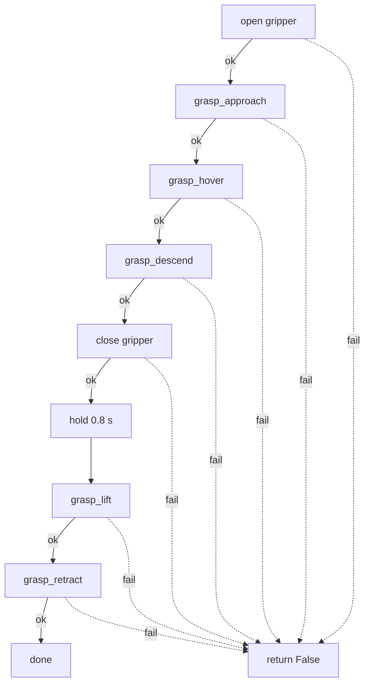
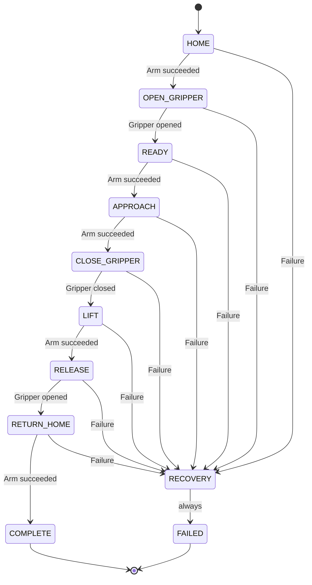

# mycobot_sim_projects — Theory & State Machines

This file documents the underlying theory and control logic (state machines,
math, timing) behind each node in this package. Code comments explain *what*
a given line does; this file explains *why* the node is built the way it is,
at a level above any single line.

Whenever a project's control logic changes meaningfully — a new state, a new
timing model, a different interpolation scheme — update that project's
section here in the same commit.

## Roadmap

9 of 17 planned projects complete. Each row links to its section below.
Numbering here tracks completion order within this file, not any external
project-list numbering.

| # | Project | File | Status |
|---|---|---|---|
| 01 | Automatic pose sequence | [pose_sequence.py](#pose_sequencepy--smooth-pose-sequencer) | ✓ Done |
| 02 | Keyboard arm and gripper control | [keyboard_control.py](#keyboard_controlpy--interactive-joint-jog-controller) | ✓ Done |
| 03 | Joint-state safety monitor | [joint_monitor.py](#joint_monitorpy--joint-state-safety-monitor) | ✓ Done |
| 04 | Forward kinematics and TF explorer | [tf_explorer.py](#tf_explorerpy--end-effector-pose-monitor) | ✓ Done |
| 05 | Gazebo trajectory-controller pose commander | [gazebo_pose_commander.py](#gazebo_pose_commanderpy--named-pose-trajectory-commander) | ✓ Done |
| 06 | Gazebo gripper-action commander | [gripper_commander.py](#gripper_commanderpy--named-position-gripper-commander) | ✓ Done |
| 07 | Pick-and-place manipulation state machine | [manipulation_state_machine.py](#manipulation_state_machinepy--pick-and-place-state-machine) (+ [UI layer](#ui-layer-manipulation_state_machine_uipy)) | ✓ Done |
| 08 | Overhead RGB camera + bridge | [mycobot_table.sdf](#overhead-rgb-camera--bridge-step-14) + `gazebo_sim.launch.py` | ✓ Done |
| 09 | OpenCV cube detection + pixel→world | [color_cube_detector.py](#opencv-cube-detection--pixelworld-step-15), [pixel_to_world.py](#opencv-cube-detection--pixelworld-step-15) | ✓ Done |

Since project 05 was marked done, `gazebo_pose_commander.py` grew a second,
tuned capability — a full top-down `pick_cube` grasp sequence for the
scene's actual grasp target — documented inline in that project's section
below rather than as a separate numbered row. A MoveIt motion-planning
config (`mycobot_280jn_moveit_config`, a sibling package) was also added;
see [MoveIt integration](#moveit-integration-mycobot_280jn_moveit_config--in-progress)
near the end of this file — it isn't one of the 17 numbered projects and
has no custom node yet, so it's tracked separately, not in the table above.

---

## pose_sequence.py — Smooth Pose Sequencer

**Node:** `pose_sequence`
**Topic:** publishes `sensor_msgs/JointState` on `/joint_states`

### Purpose

Cycles the myCobot through a fixed list of named poses (`Home` → `Observe`
→ `Pick-ready` → back to `Home`, ...), moving smoothly between them instead
of jumping instantly, so the motion looks continuous in RViz/simulation.

### Theory: linear interpolation (lerp)

Each joint angle is driven independently by the same normalized progress
value `alpha`:

```
position(t) = start + alpha(t) * (target - start)
alpha(t)    = clamp(elapsed_seconds / transition_duration, 0.0, 1.0)
```

- `alpha = 0.0` → still at `start_positions` (the pose the glide began from).
- `alpha = 1.0` → arrived exactly at `target_positions`.
- All six joints share the same `alpha`, so they start and stop moving in
  lockstep rather than arriving at different times — this is what makes the
  motion look coordinated rather than jerky.

This is a linear (constant-velocity) profile, not an eased one — no
acceleration/deceleration ramp. It's simple and fine for a slow demo pace;
it will look mechanically abrupt at pose transitions if `transition_duration`
is made very short.

### State machine

The node's timer callback (`update_motion`, running at `publish_frequency`
Hz) is a two-state machine per pose-to-pose move:

```
        transition_duration elapsed (alpha >= 1.0)
   ┌───────────────────────────────────────────────┐
   │                                                 ▼
┌─────────────────┐                        ┌──────────────────┐
│  TRANSITIONING   │                        │      HOLDING      │
│  (lerp glide)    │                        │  (paused at pose) │
└─────────────────┘                        └──────────────────┘
   ▲                                                 │
   └─────────────────────────────────────────────────┘
       hold_duration elapsed → advance target_index,
       reset start_positions/transition_start_time
```

- **TRANSITIONING**: `current_positions` is recomputed every tick via lerp
  between `start_positions` and `target_positions`. On reaching `alpha >= 1.0`,
  position snaps exactly onto `target_positions` (avoids float drift from
  accumulated lerp math) and the state flips to HOLDING.
- **HOLDING**: `current_positions` is unchanged; the node just keeps
  re-publishing it. Once `hold_duration` has elapsed, `start_next_transition`
  advances `target_index` (wrapping via `% len(self.poses)`), sets a new
  `target_positions`, and flips back to TRANSITIONING.

Every tick in both states calls `publish_joint_state()`, so `/joint_states`
always reflects `current_positions` — the arm's currently-commanded pose,
whether mid-glide or held.

### Timing knobs

| Field | Meaning |
|---|---|
| `transition_duration` | Seconds to glide between two poses (3.0s) |
| `hold_duration` | Seconds to pause once a pose is reached (1.5s) |
| `publish_frequency` | Recompute/publish rate during motion, in Hz (20.0) |

---

## keyboard_control.py — Interactive Joint Jog Controller

**Node:** `keyboard_control`
**Topic:** publishes `sensor_msgs/JointState` on `/joint_states`

### Purpose

Lets an operator jog the myCobot's six joints directly from the terminal
keyboard, one joint at a time, and open/close the adaptive gripper — for
manual inspection/testing, as opposed to `pose_sequence.py`'s scripted,
hands-off playback.

### Theory: single-joint incremental jog with clamped limits, plus gripper open/close presets

Unlike pose_sequence's lerp between two full 6-DOF poses, this node holds one
persistent `positions` vector — now seven entries: six arm joints plus the
gripper (`gripper_controller`) — and nudges exactly one selected joint per
keypress:

```
positions[selected] = clamp(positions[selected] + step,
                             lower_limits[selected], upper_limits[selected])
```

- `step_size` is a fixed ±5° (`math.radians(5.0)`) per `+`/`-` keypress —
  there's no velocity ramp; each press is a discrete jump, not a glide.
- Every joint is independently clamped to its URDF joint limits
  (`lower_limits`/`upper_limits`). Clamping is silent in the published state
  (the value simply stops changing at the bound) but logs a warning so the
  operator understands why further presses have no effect.
- `selected_joint` can only be 0-5 (set by the `1`-`6` keys), so this
  increment/clamp path never actually reaches index 6, the gripper —
  `lower_limits[6]`/`upper_limits[6]` are defined but unused by
  `change_selected_joint`.
- The first six limits are copied from the arm's URDF (`joint2_to_joint1`
  through `joint6output_to_joint6`), not queried at runtime. Re-check them
  against the source if the description package changes:
  ```
  grep -nE '<joint|<limit' \
    mycobot_ros2/mycobot_description/urdf/mycobot_280_jn/mycobot_280_jn_adaptive_gripper.urdf
  ```

The gripper (`positions[6]`) uses a different, simpler mechanism: the `o`/`c`
keys jump it directly to one of two fixed presets instead of stepping it —

```
positions[6] = gripper_open_position    # 'o' -> 0.0 rad
positions[6] = gripper_closed_position  # 'c' -> -0.5 rad
```

No clamp call is needed here because both presets are already valid targets.
The URDF's actual `gripper_controller` range is `[-0.74, 0.15]` rad, but the
node only ever commands `-0.5` (closed) or `0.0` (open) — a deliberately
narrower "practical" range rather than the mechanical extremes, so the
fingers don't over-travel. The `lower_limits[6]`/`upper_limits[6]` pair
(`-0.5`/`0.15`) stored alongside the arm limits only half-matches this: the
lower bound lines up with `gripper_closed_position`, but the upper bound
(`0.15`, the URDF's mechanical max) is never actually commanded — `o` opens
to `0.0`, not `0.15`.

- All seven positions (six arm joints + gripper) are re-published on
  `/joint_states` every tick regardless of whether a key was pressed, at the
  same rate as the polling timer.
- `h` (home) resets all six arm joints to 0.0 rad *and* the gripper to
  `gripper_closed_position` — so "home" doubles as "put the gripper in a
  known state," not just the arm.

### Data flow

`keyboard_control` only owns the first three boxes; `/joint_states` is the
handoff point where the wider simulation stack (`robot_state_publisher` →
RViz) picks up the published positions and turns them into a rendered pose.

```mermaid
flowchart TD
    A[Keyboard input] --> B[keyboard_control node]
    B --> C[Check joint limit]
    C --> D[/joint_states]
    D --> E[robot_state_publisher]
    E --> F[RViz]
```

The "Check joint limit" box applies to the six arm joints (`+`/`-`, via
`change_selected_joint`'s clamp); the gripper's `o`/`c` presets skip it
entirely and write `positions[6]` directly, as described above.

### State machine

This node isn't a pose-to-pose state machine like `pose_sequence.py` — it's
better described as an event loop with a small piece of session state
(`selected_joint`, `positions`) mutated by keypress events:

| Key | Effect |
|---|---|
| `1`-`6` | select which joint subsequent `+`/`-` presses affect |
| `+` / `=` | increase selected joint by `step_size`, clamped to its upper limit |
| `-` | decrease selected joint by `step_size`, clamped to its lower limit |
| `o` | jump gripper directly to `gripper_open_position` (0.0 rad) |
| `c` | jump gripper directly to `gripper_closed_position` (-0.5 rad) |
| `h` | reset all six arm joints to 0.0 rad and the gripper to closed ("home") |
| `p` | print current positions (degrees) to the terminal |
| `q` | call `rclpy.shutdown()`, ending the node |

### Timing / IO knobs

| Field | Meaning |
|---|---|
| `step_size` | Radians per keypress, fixed at 5° (arm joints only) |
| `gripper_open_position` | Fixed gripper target for `o`, 0.0 rad |
| `gripper_closed_position` | Fixed gripper target for `c` and `h`, -0.5 rad |
| timer period | 0.05s (20 Hz) — polls stdin non-blockingly via `select.select` and republishes `/joint_states` every tick |

The terminal is put into cbreak mode (`tty.setcbreak`) in `main()` so keys
are read immediately without waiting for Enter; original terminal settings
are restored in a `finally` block on exit so the shell isn't left in a
broken input mode.

---

## joint_monitor.py — Joint-State Safety Monitor

**Node:** `joint_monitor`
**Topic(s):** subscribes to `sensor_msgs/JointState` on `/joint_states`; publishes nothing

### Purpose

A passive safety observer: it doesn't command the arm or publish anything,
it just watches whatever is already publishing `/joint_states` (
`keyboard_control.py`, `pose_sequence.py`, or anything else) and reports two
independent things — whether each joint is approaching its URDF limits, and
whether `/joint_states` itself is still being published on schedule.

### Theory: normalized margin classification

Each joint's position is classified against its own `(lower, upper)` limit
pair (the same six values documented in `keyboard_control.py`'s limits
table) using a 0–1 normalized position within that range:

```
normalized = (position - lower) / (upper - lower)

INVALID     if position < lower or position > upper
NEAR_LOWER  if normalized <= 0.10
NEAR_UPPER  if normalized >= 0.90
NORMAL      otherwise
```

This is a *soft* margin warning, not a hard limit enforced by this node —
unlike `keyboard_control.py`, which clamps its own output at the source,
`joint_monitor.py` only classifies and reports positions it receives from
elsewhere; it has no way to stop the arm.

Two supporting values are computed per joint for the report line:
`calculate_percentage` (the same `normalized` value, as a 0–100% figure) and
`calculate_nearest_margin` (`min(position - lower, upper - position)`, the
angular distance in radians to whichever limit is closer).

### State machine

Two independent state machines run in this node, on different triggers:

**1. Per-joint safety status** — driven by every incoming `/joint_states`
message, in `joint_state_callback`:

```
NORMAL ⇄ NEAR_LOWER ⇄ INVALID
   ⇅
NEAR_UPPER ⇄ INVALID
```

Transitions aren't actually constrained to adjacent states as drawn above —
`calculate_status` is stateless and re-evaluates from scratch every message,
so a joint can jump directly from `NORMAL` to `INVALID` in one tick (e.g. a
large instantaneous jump from `pose_sequence.py`). What *is* stateful is the
logging: `previous_status` (a dict keyed by joint name) is compared against
the freshly computed status, and `report_status_change` only logs — at
`error` for `INVALID`, `warning` for `NEAR_LOWER`/`NEAR_UPPER`, `info` for a
return to `NORMAL` — on an actual transition. This is edge-triggered logging:
without it, a joint sitting still at 95% of its range would spam a warning
on every single `/joint_states` message instead of once.

**2. Topic health check** — driven independently by the 1 Hz `report_timer`,
in `print_report`:

| Condition | Action |
|---|---|
| No message ever received | Log `"Waiting for /joint_states"`, skip the report |
| `age_seconds > 1.0` since the last message | Log `error` with the staleness duration, skip the report |
| Otherwise | Print the full per-joint table + an approximate message rate |

This catches a stalled publisher (e.g. `keyboard_control.py` was killed,
or nothing is publishing `/joint_states` at all) independently of whether
any individual joint's position is safe.

### Timing / IO knobs

| Field | Meaning |
|---|---|
| subscription queue depth | 10 messages |
| `report_timer` period | 1.0s — prints the summary table and runs the staleness check |
| staleness threshold | 1.0s since the last `/joint_states` message |
| message-rate estimate | `message_count` delta between consecutive 1s ticks — an approximation, not a precise Hz measurement |

---

## tf_explorer.py — End-Effector Pose Monitor

**Node:** `tf_explorer`
**Topic(s):** none published; subscribes to `/tf` and `/tf_static` (via `TransformListener`)

### Purpose

A read-only diagnostic node: it does not command the arm, it just watches the
TF tree and prints the gripper's pose relative to the base once per second.
It's the scripted, always-on counterpart to running `tf2_echo` by hand — see
the [TF validation](#tf-validation--joint1-to-gripper_base) section below,
which now also carries a sample of this node's own output.

### Theory: quaternion → Euler, and "latest available" lookups

`tf_buffer.lookup_transform(base_frame, tool_frame, Time())` is called with a
zero `Time()`, which `tf2` treats as "give me the most recent transform you
have" rather than a specific timestamp — no time-sync/extrapolation logic is
needed since the node doesn't care about a particular instant, only the
current pose.

The returned quaternion `(x, y, z, w)` is converted to intrinsic roll/pitch/yaw
with the standard closed-form formulas:

```
roll  = atan2(2(wx + yz), 1 - 2(x² + y²))
pitch = asin(clamp(2(wy - zx), -1, 1))
yaw   = atan2(2(wz + xy), 1 - 2(y² + z²))
```

`atan2` is used for roll/yaw instead of `atan`/`asin` so the correct quadrant
is recovered automatically. `sin_pitch` is clamped to `[-1, 1]` before calling
`asin` — floating-point rounding can push it a hair outside that range (e.g.
`1.0000000002`), which would otherwise raise a `math domain error` right at
the ±90° gimbal-lock boundary.

Three scalar distances are derived from the translation for quick reach
sanity-checks: straight-line distance from the base
(`sqrt(x² + y² + z²)`), horizontal reach ignoring height
(`sqrt(x² + y²)`), and height (`z` alone).

### Reading the printed fields

| Line | Meaning |
|---|---|
| `Position [m]` | Translation `(x, y, z)` of `gripper_base`'s origin, expressed in `joint1` coordinates. A negative `x` or `y` isn't an error — it just means the gripper sits on the negative side of that axis, not that anything is wrong. |
| `Quaternion [xyzw]` | The raw orientation as received from TF. Should always satisfy `x² + y² + z² + w² ≈ 1` (unit length); if it doesn't, something upstream is publishing a malformed transform. |
| `RPY [degrees]` | The same orientation, converted for readability. A value like `-0.0°` is floating-point noise around exact zero, not a real negative rotation. |
| `Distance from base` | 3D Euclidean distance — straight-line reach from `joint1`'s origin to the gripper, independent of direction. |
| `Horizontal reach` | Distance ignoring `z` — how far the gripper extends sideways from the vertical axis through the base. A small value (with a large `Height`) means the arm is mostly upright rather than reaching outward. |
| `Height` | Just `z`, restated on its own line. Height above `joint1`'s origin, not necessarily above a physical table — that offset depends on how `joint1` is mounted relative to the table in the URDF/world. |

### State machine

There's no multi-state model here, just a single polling loop:

| Tick (every 1.0s) | Action |
|---|---|
| Transform available | Compute Euler angles + distances, print pose block |
| Transform unavailable (`TransformException`) | Log a warning with the error, skip this tick |

Failures are expected transiently at startup (before `robot_state_publisher`
has published the first `/tf` message) and self-resolve on the next tick once
publishing catches up.

---

## TF validation — `joint1` to `gripper_base`

The pose produced by `robot_state_publisher` can be checked independently of
RViz with `tf2_echo`. After sourcing ROS 2 and the built workspace, run:

```bash
source /opt/ros/humble/setup.bash
source /root/mycobot_ws/install/setup.bash
ros2 run tf2_ros tf2_echo joint1 gripper_base
```

For the measured joint configuration, the reported transform was:

```text
Translation: [0.016, 0.101, 0.436] m
Quaternion (xyzw): [0.004, 0.001, 0.259, 0.966]
RPY: [0.008, 0.000, 0.524] rad
RPY: [0.470, 0.000, 30.000] deg

 0.866  -0.500   0.004   0.016
 0.500   0.866  -0.007   0.101
-0.000   0.008   1.000   0.436
 0.000   0.000   0.000   1.000
```

This means that the origin of `gripper_base`, expressed in the `joint1`
coordinate frame, is approximately 1.6 cm along X, 10.1 cm along Y, and
43.6 cm along Z. Its orientation is approximately a 30-degree yaw about Z,
with a small 0.47-degree roll and effectively zero pitch. The quaternion and
RPY values are two representations of the same orientation.

The homogeneous transform has the form

```text
T_joint1_gripper = [ R  t ]
                   [ 0  1 ]
```

where the upper-left `3 x 3` block `R` is the rotation and the last column
`t = [0.016, 0.101, 0.436]^T` is the translation in metres. It converts a
point expressed in `gripper_base` coordinates into `joint1` coordinates:

```text
p_joint1 = R * p_gripper_base + t
```

Ignoring the very small roll, the rotation block is the standard Z-axis
rotation for a 30-degree yaw (`cos(30 deg) = 0.866`, `sin(30 deg) = 0.500`).
`tf2_echo` prints continuously, so identical blocks in the terminal output
are successive TF samples rather than separate transforms. The `At time`
value is the ROS timestamp associated with each sample. This pose is a
snapshot: it changes when any joint between the two frames moves.

### Alternative: `tf_explorer.py`

The same transform can be monitored with this package's own
[tf_explorer.py](#tf_explorerpy--end-effector-pose-monitor) node instead of
`tf2_echo`, which additionally prints derived reach/height distances:

```bash
ros2 run mycobot_sim_projects tf_explorer
```

Sample output, for a joint configuration jogged away from the one above
(via `keyboard_control.py`):

```text
End-effector pose
-----------------
Position [m]: x=-0.046, y=0.001, z=0.436
Quaternion [xyzw]: [0.004, 0.001, 0.301, 0.954]
RPY [degrees]: roll=0.5, pitch=-0.0, yaw=35.0
Distance from base: 0.439 m
Horizontal reach: 0.046 m
Height: 0.436 m
```

The two repeated blocks in a raw terminal capture are successive 1 Hz ticks
of the same pose (the arm was holding still), just like repeated `tf2_echo`
blocks — not two different transforms. This sample's yaw (35°) and negative
`x` versus the `tf2_echo` sample above (30° yaw, positive `x`) simply reflect
a different `joint1` angle at capture time; `z` (height) is unchanged at
0.436 m because only the base joint was moved between samples.

A second sample, taken after jogging further:

```text
End-effector pose
-----------------
Position [m]: x=0.080, y=-0.065, z=0.436
Quaternion [xyzw]: [0.003, -0.003, -0.707, 0.707]
RPY [degrees]: roll=0.5, pitch=0.0, yaw=-90.0
Distance from base: 0.448 m
Horizontal reach: 0.103 m
Height: 0.436 m
```

Yaw is now -90°, and the RViz view for this sample shows the arm swung
around to a different side than the 35° sample, consistent with a further
rotation of `joint1`. `z` is still 0.436 m — as expected, since none of the
three samples so far have moved anything other than the base joint. Between
all three captures, the readings are internally consistent with each other
(same forward kinematics, same fixed link lengths), which is the point of
cross-checking `tf_explorer.py` against `tf2_echo`: they must always agree,
since both are just reading the same `/tf` tree.

---

## gazebo_pose_commander.py — Named-Pose Trajectory Commander

**Node:** `gazebo_pose_commander`
**Action:** client on `/arm_controller/follow_joint_trajectory` (`control_msgs/action/FollowJointTrajectory`)

### Purpose

A CLI for driving the arm through `arm_controller` — the real trajectory
controller running inside `controller_manager` (configured in the sibling
`mycobot_280jn_sim` package). This is a different control path from every
node above — those publish `/joint_states` directly and bypass ros2_control
and physics entirely; this one's motion is actually interpolated and
physically simulated by Gazebo.

It now does two distinct jobs from one `POSES` table and one CLI entry
point:

- **Single named pose** (`home`, `ready`, `observe`, `left_ready`, plus the
  older side-pick and calibrated poses) — send one waypoint, wait for
  completion, exit. This is the original behavior.
- **`pick_cube`** — a full scripted top-down grasp of the scene's dynamic
  `pick_cube` (see [pick_cube — Grasp Target](#pick_cube--grasp-target)
  below): open the gripper, drive the arm through a staged
  approach/hover/descend sequence, close the gripper, hold briefly, then
  lift back out through hover/retract. This is the concrete, tuned
  realization of the sequence the
  [Combined arm-and-gripper control flow](#combined-arm-and-gripper-control-flow)
  section anticipated, developed and tuned specifically against this scene's
  25 mm cube (see `PICK_CUBE_HANDOFF.md` in this package for the iterative
  debugging history — offset fixes, cube resizing, descend-height retuning,
  and the gripper-timeout fix, in the order they were found).

By deliberate design (a user-set constraint, not a technical one), **all**
pick-specific logic lives here, not in `manipulation_state_machine.py` — see
that project's section below for how it stayed generic instead.

### Theory: joint-space error and action-based sequencing

The arm configuration is a 6-vector, one entry per `JOINT_NAMES`. A named
pose supplies a desired configuration `qd`; the per-joint error the
controller works to drive to zero is:

```
e = qd - q      (e_i = qd_i - q_i for each joint)
```

`_validate_pose` doesn't compute `e` itself — it only checks `qd` is
well-formed (six finite values, each within `JOINT_LIMITS`, the same six
limits documented in `keyboard_control.py`'s limits table) before sending
it. The error above is what `arm_controller` does with `qd` once accepted.

A single trajectory point carries `positions = qd`, `velocities = 0`, and
`time_from_start = duration`. That's the same "start now, arrive after T
seconds" shape as `pose_sequence.py`'s lerp, just computed by
`arm_controller` instead of by this package's own timer:

```
qi(t)    = qi_start + alpha(t) * (qi_target - qi_start)
alpha(t) = t / T,   0 <= t <= T
```

Inside Gazebo, each interpolated `qi(t)` reaches physics through
`gz_ros2_control`'s position command interface, which closes its own
proportional loop first (`position_proportional_gain` is logged as `0.1` at
Gazebo startup):

```
qi_dot_command = Kp * (qi_command - qi_measured)
```

so the commanded velocity shrinks toward zero as the joint approaches its
target.

Because this is an action rather than a topic, `execute()` blocks twice:
once for goal acceptance (`send_goal_async`), once for the actual result
(`get_result_async`) — so a caller always knows the previous move fully
finished before issuing the next one. That guarantee is what the
`pick_cube` routine below (and, separately, `manipulation_state_machine.py`)
is built on.

### Theory: top-down grasp geometry

`pick_cube`'s five grasp poses (`grasp_approach`, `grasp_hover`,
`grasp_descend`, `grasp_lift`, `grasp_retract`) all share the same wrist
orientation — only `j2`, `j3`, `j4` differ between them:

```
j1 ≈ 0.330216   (centers the TCP in XY over the cube at (0.20, 0.00))
j5 ≈ -0.007679  \
j6 ≈ -1.240580  / fixed "wrist-down" orientation for every grasp pose
```

Holding `j1`/`j5`/`j6` fixed and varying only `j2`-`j4` means the sequence
is a **pure vertical descent/ascent** in task space, not a general 6-DOF
move — every intermediate pose keeps the gripper pointed straight down and
centered over the cube, only its height changes:

| Pose | FK TCP height (`joint1` frame) | Role |
|---|---|---|
| `grasp_approach` | ≈ 0.140 m | Safe height clear of the table; also the lift's final "carry" height (`grasp_retract` is identical) |
| `grasp_hover` | ≈ 0.105 m | Mid-height waypoint, used on both the way down and the way up (`grasp_lift` is identical) |
| `grasp_descend` | ≈ 0.054 m | Pre-close height, ~34 mm above the 25 mm cube's top (cube top ≈ 0.020 m in `joint1` frame) — low enough for the open gripper to bracket the cube, not low enough to push into the table or the cube itself |

Lift is descend's reverse, not a shortcut back to approach in one move
(`LIFT_SEQUENCE = (grasp_lift, grasp_retract)`, i.e. descend-height →
hover-height → approach-height): jumping straight from `grasp_descend` to
`grasp_approach` sweeps the arm through an arc that clips the table before
it clears it. The two-stage lift was added specifically to fix that.

`grasp` is a leftover alias for `grasp_descend`'s values, and
`top_pick_approach_calibrated`/`top_pick_pregrasp_calibrated` are older
names kept mapped to `grasp_approach`/`grasp_descend` for backward
compatibility with earlier scripts/notes. `pick_approach`/`pick_pregrasp`/
`pick_test` are an even older side-pick attempt (non-vertical wrist),
retained only for reference — `pick_cube` never uses them.

### Theory: gripper action integration and timeout-tolerant closing

`open_gripper()`/`close_gripper()` drive
`/gripper_action_controller/gripper_cmd` directly (the same action
`gripper_commander.py` and `controllers.yaml`'s stall model use), but this
node adds a **bounded wait** on top via `_send_gripper_goal(...,
timeout_sec, proceed_on_timeout)` and `_wait_future` (a `spin_once` polling
loop with a deadline, instead of an unbounded
`spin_until_future_complete`):

```
open:  timeout = 10.0 s, proceed_on_timeout = False  (must actually finish)
close: timeout =  3.0 s, proceed_on_timeout = True   (may time out and still proceed)
```

This exists because closing on a real object can leave the gripper action's
result future unresolved for longer than expected — a goal that's
genuinely stalled against the cube can still be mid-flight from
`gripper_action_controller`'s point of view. Without a bounded wait, a pick
that successfully grasped the cube could hang forever waiting for a result
that was already effectively "done" in practice. `close_gripper()` accepts
three outcomes as success: a clean `reached_goal`, a reported `stalled`
(the expected result of closing on the cube — same reasoning as
`manipulation_state_machine.py`'s `CLOSE_GRIPPER`), or a bare timeout
(logged as a warning, since a stall this method can't observe in time is
still the common/expected case here). Only `open_gripper()`'s 10 s window
is treated as a hard requirement, since opening never stalls against
anything.

`GRIPPER_HOLD_SEC` (0.8 s) is a deliberate dwell between `close_gripper()`
returning and the lift sequence starting — giving the simulated contact a
moment to settle before the arm starts moving again, rather than lifting
the instant the close action returns.

### Theory: per-pose duration overrides

`_step_duration()` stretches the CLI's single `--duration` value
differently depending on which pose is being executed, rather than using
one flat duration for every waypoint:

```
grasp_descend        → max(duration * 0.7, 3.5) s   # slow, controlled final descent
grasp_hover           → max(duration * 0.7, 2.5) s
grasp_lift/retract    → max(duration * 0.8, 4.0) s   # slow lift, avoid jostling the grasp
everything else       → duration unchanged
```

The floor (`DESCEND_MIN_DURATION_SEC` / `LIFT_MIN_DURATION_SEC`) guards
against a caller passing a short `--duration` that would otherwise rush
exactly the two moves (final descent, and lift-with-grasped-object) where
speed most risks knocking the cube over or breaking the grip.

### State machine

`gazebo_pose_commander` itself holds no persistent state for a *single*
named pose — one `execute()` call is one linear pass through validate →
wait-for-server → send → wait-for-result. The state machine for that path
lives on the *server* side, in `arm_controller`. Modeled from its action
interface, not its internal source:

| State | Meaning | Transition |
|---|---|---|
| IDLE | waiting for a goal | goal received → VALIDATING |
| VALIDATING | checks joint names against `arm_controller`'s configured `joints` list; `allow_partial_joints_goal: false` means all six must be present | valid → EXECUTING; invalid → REJECTED |
| EXECUTING | interpolates and commands all six joints toward the trajectory's final point | final point reached → GOAL_CHECK |
| GOAL_CHECK | checks `stopped_velocity_tolerance` (0.05 rad/s) within the extra `goal_time` window (2.0 s) | satisfied → SUCCEEDED; timeout → ABORTED |
| CANCELLED | an in-flight trajectory was pre-empted | → IDLE |

`_validate_pose`'s own six-value/limit checks catch most REJECTED cases
before a goal is even sent — the controller-side VALIDATING step is the
second line of defense, not the only one.

`execute_pick_cube()` chains eight of those single-pose/gripper steps into
one linear, fail-fast sequence — unlike `manipulation_state_machine.py`
below, there is no `RECOVERY` state here; any failed step logs where it
stopped and returns `False` immediately, leaving the arm wherever it was:



`execute_grasp_approach()` is the same idea truncated to just
open → `GRASP_SEQUENCE` (approach → hover → descend), then it stops and logs
the manual follow-up commands (`gripper_commander -- close`, then
`grasp_lift`, then `grasp_retract`) — useful for stepping through a pick by
hand while tuning, without committing to the full automated close-and-lift.

---

## gripper_commander.py — Named-Position Gripper Commander

**Node:** `gripper_commander`
**Action:** client on `/gripper_action_controller/gripper_cmd` (`control_msgs/action/GripperCommand`)

### Purpose

The gripper's counterpart to `gazebo_pose_commander.py`: a CLI client that
sends one position goal — `open`, `half`, `close`, or a `custom` radian
value — to `gripper_action_controller`, prints live feedback while it
executes, and reports whether the target was reached or the gripper
stalled. This is the scripted equivalent of the manual `ros2 action
send_goal` commands documented under "controllers.yaml — Adaptive-Gripper
Action Controller" below.

### Theory: presets vs. full range, and interpreting the result

`GRIPPER_MIN`/`GRIPPER_MAX` (-0.74/0.15) are the joint's full URDF range;
`NAMED_COMMANDS`' three presets (`open` 0.0, `half` -0.25, `close` -0.5) are
the same practical values used throughout this package (`keyboard_control.py`'s
`o`/`c` keys command the same open/close positions). `custom` is the only
path here that can reach the rest of the mechanical range between those
presets and the URDF limits.

Unlike `gazebo_pose_commander.py`, this node passes a `feedback_callback`
to `send_goal_async`, so it prints position/effort/`stalled`/`reached_goal`
readings repeatedly while the goal is executing, not just once at the end.

Two different "successful" outcomes are surfaced explicitly rather than
collapsed into one message: `reached_goal` (clean arrival at the target)
versus `stalled` (motion stopped early — per the stall model in the
controller's theory section below). Both return `True` from `execute()`,
but log different messages so the caller can tell which one actually
happened. `status` is checked against `GoalStatus.STATUS_SUCCEEDED` before
either flag is trusted, since a `result_future` can resolve to a non-null
result even when the action itself didn't succeed.

### State machine

Like `gazebo_pose_commander.py`, this node holds no persistent state of its
own — `execute()` is one linear pass: validate → wait for server → send
goal (with live feedback) → wait for result → interpret
`status`/`reached_goal`/`stalled`. The actual state machine lives in
`gripper_action_controller`, already documented in "controllers.yaml —
Adaptive-Gripper Action Controller" below.

---

## controllers.yaml — myCobot Arm Trajectory Controller

**Controller:** `arm_controller` (`joint_trajectory_controller/JointTrajectoryController`), defined in `mycobot_280jn_sim/config/controllers.yaml`, spawned by `gazebo_sim.launch.py`
**Action:** `/arm_controller/follow_joint_trajectory` — what `gazebo_pose_commander.py` talks to.

### Theory: tolerances

Two constraints gate a SUCCEEDED result:

```
stopped_velocity_tolerance: 0.05   # rad/s — must be nearly still at the end
goal_time: 2.0                     # extra seconds allowed to settle
```

`allow_partial_joints_goal: false` means a trajectory must name all six
joints (matching `JOINT_NAMES` in `gazebo_pose_commander.py`) or it's
rejected outright — there is no way to move a subset of the arm through this
controller. `state_publish_rate` (50 Hz) and `action_monitor_rate` (20 Hz)
are separate: how often state is published versus how often action feedback
is checked.

---

## controllers.yaml — Adaptive-Gripper Action Controller

**Controller:** `gripper_action_controller` (`position_controllers/GripperActionController`)
**Action:** `/gripper_action_controller/gripper_cmd` (`control_msgs/action/GripperCommand`)
**Primary joint:** `gripper_controller` — the same joint `keyboard_control.py`'s `o`/`c` keys drive directly.

### Purpose

Commands only the single `gripper_controller` joint; Gazebo derives the
five follower-finger joints from the URDF `<mimic>` tags on
`mycobot_280jn_sim.urdf.xacro`'s `ros2_control` block — the same
mimic relationship `keyboard_control.py`'s theory section already notes for
this joint.

### Manual testing

The action can be driven directly from the command line, without any node
in this package — useful for confirming the controller itself works before
blaming a client. Open:

```bash
ros2 action send_goal -f \
  /gripper_action_controller/gripper_cmd \
  control_msgs/action/GripperCommand \
  "{command: {position: 0.0, max_effort: 5.0}}"
```

Close:

```bash
ros2 action send_goal -f \
  /gripper_action_controller/gripper_cmd \
  control_msgs/action/GripperCommand \
  "{command: {position: -0.5, max_effort: 5.0}}"
```

`-f` streams feedback as the goal executes. Both commands block in the
terminal until the action returns a result — SUCCEEDED with `reached_goal:
true` for a clear close/open, or `stalled: true` if something (e.g. an
object between the fingers) stopped the joint early, per the stall model
below.

### Theory: mimic mapping and stall detection

Each follower position is a linear function of the primary joint:

```
q_follower = m * q_gripper + b      (b = 0 for all five)
```

| Mimic joint | Multiplier |
|---|---|
| `gripper_base_to_gripper_left2` | +1.0 |
| `gripper_left3_to_gripper_left1` | -1.0 |
| `gripper_base_to_gripper_right3` | -1.0 |
| `gripper_base_to_gripper_right2` | -1.0 |
| `gripper_right3_to_gripper_right1` | +1.0 |

For a close command (`q_gripper = -0.5`, matching `keyboard_control.py`'s
`gripper_closed_position`), a `+1.0` follower moves to `-0.5` and a `-1.0`
follower moves to `+0.5` — opposite-signed followers close from opposite
sides of the gripper base, producing coordinated finger closure rather than
every finger moving the same direction.

A goal is reached when:

```
|qd_gripper - q_gripper| <= goal_tolerance   # 0.02 rad
```

`max_effort` (sent per-goal, e.g.
`{command: {position: -0.5, max_effort: 5.0}}`) caps how hard the simulated
joint pushes — this is what makes a *stall* meaningful instead of the
fingers just phasing through whatever they're gripping.

Stall detection runs independently of the goal-tolerance check:

```
stalled  if |q_gripper_dot| <= stall_velocity_threshold (0.01 rad/s)
            for >= stall_timeout (1.0 s)
```

`allow_stalling: true` means a stall is treated as a *successful* result
(`stalled: true`) rather than an error — an empty gripper closing fully
reaches `-0.5` rad and reports `reached_goal: true`; a gripper closing on an
object stops early (e.g. around `-0.30` rad) and reports `stalled: true`
instead, which is the expected outcome of a real grasp, not a failure.

### State machine

Modeled the same way as `arm_controller`'s above, from the action interface
rather than internal source:

| State | Meaning | Transition |
|---|---|---|
| IDLE | waiting for a goal | goal received → VALIDATING |
| VALIDATING | checks the requested position/effort | valid → MOVING; invalid → REJECTED |
| MOVING | commands `gripper_controller` toward the target | target reached → SUCCEEDED; velocity drops below threshold before reaching it → STALL_MONITORING |
| STALL_MONITORING | tracks how long velocity has stayed below `stall_velocity_threshold` | motion resumes → MOVING; `stall_timeout` reached and `allow_stalling` → SUCCEEDED; `stall_timeout` reached and stalling disallowed → ABORTED |
| CANCELLED | an in-flight command was pre-empted | → IDLE |

---

## Combined arm-and-gripper control flow

`arm_controller` and `gripper_action_controller` are still independent
action servers — neither one sequences the other — but this package now
has two nodes that sequence them from the client side, for two different
purposes:

```
Move arm above object   (arm_controller, e.g. via gazebo_pose_commander.py)
        |
Wait for arm SUCCEEDED
        |
Open gripper             (gripper_action_controller, position 0.0)
        |
Move arm down
        |
Wait for arm SUCCEEDED
        |
Close gripper            (gripper_action_controller, position -0.5)
        |
Check reached_goal vs. stalled
        |
Lift the object
```

This is exactly why `gazebo_pose_commander.py`'s `execute()` blocks on the
*result* future rather than just the goal-accepted future — any node built
on top of it can rely on one call finishing before the next begins. Two
such nodes now exist:

- **`manipulation_state_machine.py`** (documented next) — a generic,
  reusable pick/place skeleton with named states, a `RECOVERY` path, and
  demo poses (`home`/`ready`/`approach`/`lift`) that don't target any
  specific object.
- **`gazebo_pose_commander.py`'s `pick_cube`** (documented above, in that
  node's own section) — the concrete, tuned realization of this same
  flow for the scene's actual 25 mm `pick_cube`, with poses calibrated by
  hand against that specific object's size and position, plus the
  timeout/stall handling closing on a real object needed in practice.

These were deliberately kept separate rather than merged: pick-specific
tuning (exact joint values, gripper timeouts, staged descent/lift) lives
only in `gazebo_pose_commander.py`, so `manipulation_state_machine.py` stays
a clean, object-agnostic template for the next task built on this pattern.

---

## manipulation_state_machine.py — Pick-and-Place State Machine

**Node:** `manipulation_state_machine` (CLI) / `manipulation_state_machine_ui` (Tkinter GUI — same FSM, visual state flow and Start/Stop/Reset)
**Action(s):** client on both `/arm_controller/follow_joint_trajectory` (`control_msgs/action/FollowJointTrajectory`) and `/gripper_action_controller/gripper_cmd` (`control_msgs/action/GripperCommand`)

### Purpose

Runs a full pick-and-place cycle by chaining the two independent action
servers documented above into one sequenced task — see
[Combined arm-and-gripper control flow](#combined-arm-and-gripper-control-flow)
above for how this node's role now compares to `gazebo_pose_commander.py`'s
`pick_cube`. Where `gazebo_pose_commander.py` and `gripper_commander.py`
each fire a single goal and exit, this node holds a persistent `TaskState`
and walks through eight ordered arm/gripper moves (home → open → ready →
approach → close → lift → release → home) plus uniform failure handling,
entirely in this package's own code rather than inside either controller.

Its `ARM_POSES` are intentionally generic (`home`/`ready`/`approach`/`lift`,
not tuned to any particular object) and kept as this node's own local copy
rather than importing from `gazebo_pose_commander.py`. This node briefly
had the calibrated top-down grasp poses wired in during the `pick_cube`
tuning work, but was reverted on request — grasp-specific tuning
(exact joint values, gripper timeouts and stall tolerance, staged
descent/lift) stays entirely in `gazebo_pose_commander.py`'s `pick_cube`/
`grasp_*`, so this one keeps working as a self-contained, object-agnostic
demo of the pattern.

### Theory: sequencing, not new motion math

The interpolation, joint-space error, and action-handshake theory behind
each individual move is identical to `gazebo_pose_commander.py` (arm) and
`gripper_commander.py`/the `controllers.yaml` sections (gripper) — this
node's `move_arm`/`move_gripper` are effectively inlined copies of that
same two-step send/wait-for-result logic, not a new control model. What's
new here is the sequencing layer on top:

- **Blocking chain, not fire-and-forget.** Each state calls exactly one
  action and blocks (via `rclpy.spin_until_future_complete`, twice — once
  for acceptance, once for the result) until that action fully resolves.
  `transition()` only advances to the next state once the current move's
  outcome is known, so steps can never overlap or race each other.
- **One failure path for all eight happy-path states.** Every
  `move_arm`/`move_gripper` call is checked the same way: success
  transitions forward, failure calls `fail()`. There's no per-state bespoke
  error handling — `fail()` is the single place that records
  `failed_state` and routes into `RECOVERY`.
- **`RECOVERY` is a dead end by design.** It always transitions to `FAILED`
  afterward; there is no retry path. `execute_recovery()` best-effort opens
  the gripper and returns the arm home, deliberately ignoring both calls'
  return values — recovering makes the robot physically safe, it doesn't
  turn a failed task into a successful one.
- **Looser gripper success criterion than `gripper_commander.py`'s.** There,
  `reached_goal` and `stalled` are reported as distinct outcomes for the
  operator to read. Here, `move_gripper` accepts either as success, because
  `CLOSE_GRIPPER` stalling against an object *is* the desired outcome of a
  grasp (the same stall model documented in "controllers.yaml —
  Adaptive-Gripper Action Controller" above), not an error to react to.

### State machine

The state set, using the actual `TaskState` names:

```
S = {HOME, OPEN_GRIPPER, READY, APPROACH, CLOSE_GRIPPER, LIFT,
     RELEASE, RETURN_HOME, COMPLETE, RECOVERY, FAILED}
```

Every one of the eight happy-path states follows the same transition rule —
exactly one action per state, and that single action's outcome decides
where the machine goes next:

```
S(k+1) = next_state   if the state's action succeeds
S(k+1) = RECOVERY     if the state's action fails
```

`RECOVERY` and `COMPLETE`/`FAILED` don't follow this rule themselves —
`RECOVERY` transitions to `FAILED` unconditionally (see the Theory section
above), and `COMPLETE`/`FAILED` are terminal.



| State | Action performed | On success | On failure |
|---|---|---|---|
| `HOME` | `move_arm("home")` | → `OPEN_GRIPPER` | → `RECOVERY` |
| `OPEN_GRIPPER` | `move_gripper("open", 0.0)` | → `READY` | → `RECOVERY` |
| `READY` | `move_arm("ready")` | → `APPROACH` | → `RECOVERY` |
| `APPROACH` | `move_arm("approach")` | → `CLOSE_GRIPPER` | → `RECOVERY` |
| `CLOSE_GRIPPER` | `move_gripper("close", -0.5)` | → `LIFT` | → `RECOVERY` |
| `LIFT` | `move_arm("lift")` | → `RELEASE` | → `RECOVERY` |
| `RELEASE` | `move_gripper("release", 0.0)` | → `RETURN_HOME` | → `RECOVERY` |
| `RETURN_HOME` | `move_arm("home")` | → `COMPLETE` | → `RECOVERY` |
| `COMPLETE` | logs success (terminal) | `run()` returns `True` | — |
| `RECOVERY` | `execute_recovery()`: best-effort open + home, results ignored | → `FAILED` (always) | → `FAILED` (always) |
| `FAILED` | logs `failed_state`, the state that originally broke (terminal) | — | `run()` returns `False` |

Only `COMPLETE` and `FAILED` return out of `run()`'s loop; every other state
always produces a transition.

### UI layer (`manipulation_state_machine_ui.py`)

**Node:** `manipulation_state_machine_ui`
**Implementation:** Tkinter front-end wrapping the same `ManipulationStateMachine`
class — no duplicate FSM logic.

The GUI runs the FSM in a **background thread** while a `MultiThreadedExecutor`
spins the ROS node. The main thread polls `node.state` every 200 ms to repaint
a horizontal **state-flow strip** (`TASK_FLOW` order):

```
HOME → OPEN_GRIPPER → READY → APPROACH → CLOSE_GRIPPER
     → LIFT → RELEASE → RETURN_HOME → COMPLETE
```

Color coding:

| Color | Meaning |
|---|---|
| Gray | Pending (not yet reached) |
| Yellow | Current active state |
| Green | Completed earlier states |
| Red | Failed state (when `failed_state` matches) |
| Orange | Entire strip during `RECOVERY` |

Controls:

| Button | Effect |
|---|---|
| **Start sequence** | `reset()` then `run()` in a worker thread |
| **Stop** | `request_stop()` — checked at the **start of each loop iteration**, so the current arm/gripper action finishes before exit |
| **Reset** | `reset()` to `HOME` (disabled while running) |

Timing spinboxes (`--arm-duration`, `--pause`) map directly to the node's
constructor fields and are locked while a run is active.

**Requires `DISPLAY`** (same X11 forwarding as RViz). Does **not** implement
`pick_cube` — use `gazebo_pose_commander -- pick_cube` for the calibrated grasp.

---

## pick_cube — Grasp Target

**Model:** `pick_cube`, defined in `mycobot_280jn_sim/worlds/mycobot_table.sdf`
**Type:** dynamic (`<static>false</static>`) — the only movable object in
the world; the table and the arm's mount are both fixed.

### Purpose

A small cube spawned on the table for `gazebo_pose_commander.py`'s
`pick_cube` sequence (and, more generically, `manipulation_state_machine.py`)
to actually grasp. `CLOSE_GRIPPER`'s/`close_gripper()`'s "stall counts as
success" theory (see "controllers.yaml — Adaptive-Gripper Action
Controller") only means something because there's a real rigid body in the
scene for the fingers to stall against.

The cube started at 4 cm but was shrunk to **25 mm** during the `pick_cube`
tuning work (see `gazebo_pose_commander.py`'s "top-down grasp geometry"
theory above) — 40 mm was too large relative to the adaptive gripper's
20-45 mm practical opening, leaving little margin for the open fingers to
bracket it without collisions.

### Theory: resting placement

An SDF `<pose>` is a model's geometric center, not a corner, so resting a
cube flush on a surface means offsetting by half the cube's height, not by
zero:

```
cube_center_z = table_surface_z + cube_size / 2
              = 0.400   + 0.0125
              = 0.4125 m
```

matching the model's `<pose>0.20 0.00 0.4125 0 0 0</pose>` (a 25 mm cube, so
the half-height offset is 0.0125 m, not the 0.020 m a 40 mm cube would need).
Getting this wrong by even a few millimeters either embeds the cube in the
table (a contact-solver fight right at spawn) or leaves a visible gap and a
short fall before the arm ever reaches its descend pose.

In the robot's own `joint1` frame (the robot is spawned at world `z =
0.405 m`), this same cube sits at center `z ≈ 0.0075 m`, top `z ≈ 0.020 m` —
the height `grasp_descend`'s ~0.054 m TCP target is measured against in
`gazebo_pose_commander.py`'s theory section above.

High contact stiffness (`kp: 100000.0`, `kd: 10.0`) and friction
(`mu`/`mu2: 2.5`, raised from the original `1.0`) keep the cube from sinking
into the table or slipping out from under the fingers during a grasp — a
soft or low-friction cube would undermine the same stall-detection theory
that lets a close command treat a stall as a successful grasp. The friction
increase specifically targeted **slip during lift**: at `1.0` the smaller,
lighter (0.05 kg) 25 mm cube was more prone to sliding in the grip than the
original 40 mm cube had been.

### Build note: forcing a real file copy for the world file

`mycobot_280jn_sim`'s `CMakeLists.txt` used to install `worlds/` via a
generic `install(DIRECTORY ...)`, which under `colcon
--symlink-install` turns into a symlink back to the source tree. That broke
here because the Docker container and the host see the same workspace under
different absolute paths (`/root/mycobot_ws` vs `/home/raj/mycobot_ws`) — a
symlink written from inside the container can point somewhere that doesn't
resolve the same way once the world is loaded, so Gazebo kept loading a
stale (pre-resize, 40 mm) copy of `mycobot_table.sdf` even after the source
file was edited and the package rebuilt.

The fix is now two explicit CMake steps instead of the generic directory
install: `install(FILES worlds/mycobot_table.sdf ...)` plus an
`install(CODE "file(COPY ...)")` that forces an actual byte copy into the
install tree regardless of the `--symlink-install` flag. After any world
edit, a full Gazebo restart is required (not just a rebuild) — the check
described in `PICK_CUBE_HANDOFF.md` is:

```bash
grep "Cube size" /root/mycobot_ws/install/mycobot_280jn_sim/share/mycobot_280jn_sim/worlds/mycobot_table.sdf
```

### Querying its live pose

Unlike the robot's own links (queried via `/tf`, see "TF validation"
above), `pick_cube` isn't part of the robot's TF tree — it's a free-standing
world model, so its pose is queried from Gazebo directly instead:

```bash
ign model -m pick_cube --pose
```

Sample output below is from before the 40 mm → 25 mm resize (so its Z
differs from the current SDF), kept to illustrate the command's shape;
expect `[0.200000 0.000000 0.412500]` for the current cube, undisturbed at
its spawn pose:

```text
Model: [12]
  - Name: pick_cube
  - Pose [ XYZ (m) ] [ RPY (rad) ]:
    [0.200000 0.000000 0.420000]
    [0.000000 -0.000000 0.000000]
```

(The `[12]` is Gazebo's internal entity ID for this run — it depends on
spawn order and isn't a stable identifier across relaunches.) The XYZ here
matched the SDF's `<pose>` exactly at the time, confirming the cube spawned
where expected and hadn't drifted or fallen. Re-running the same command
after a grasp attempt is the quick way to check whether a pick actually
moved the cube, versus the arm having approached short and left it
untouched.

---

## MoveIt integration (mycobot_280jn_moveit_config) — in progress

**Package:** `mycobot_280jn_moveit_config` (sibling package, not part of
`mycobot_sim_projects` — documented here, like `controllers.yaml` above,
because it's a control path this package's nodes interact with, not because
it lives here)

### Purpose

A MoveIt 2 configuration for the same arm/gripper this package already
drives by hand-picked joint poses, generated with the MoveIt Setup
Assistant and then extended with two hand-written launch files wiring it
to the *existing* Gazebo simulation rather than a standalone fake
controller. As of this writing there is no custom node in
`mycobot_sim_projects` that calls into MoveIt yet — this is planning
infrastructure sitting alongside the hand-tuned pose commanders, not a
replacement for them.

### What's configured

- **`arm` planning group** (`mycobot_280jn_sim.srdf`): the kinematic chain
  from `joint1` to `gripper_tcp` — the same tip link
  `tf_explorer.py`/`tf2_echo` already report poses for (see
  [TF validation](#tf-validation--joint1-to-gripper_base) above).
- **Named group states**, the SRDF equivalent of this package's `POSES`
  dicts: `home` (all zeros) and, notably, `grasp_approach` — copied
  directly from `gazebo_pose_commander.py`'s tuned `grasp_approach` pose
  (same six joint values), so a MoveIt-planned motion and a
  `gazebo_pose_commander.py`-commanded one can be checked against the same
  reference configuration.
- **`moveit_controllers.yaml`** points MoveIt's
  `moveit_simple_controller_manager` at the *same* `arm_controller`
  (`FollowJointTrajectory`, same six `joints`) that
  `gazebo_pose_commander.py` and `manipulation_state_machine.py` already
  drive directly — MoveIt is a second client of that controller, not a
  competing one.
- **`joint_limits.yaml`** overlays conservative velocity/acceleration
  scaling (`default_velocity_scaling_factor` /
  `default_acceleration_scaling_factor`, both `0.1`) on top of the URDF's
  own limits — MoveIt-planned trajectories move at 10% of the arm's rated
  speed by default, independent of the `--duration` values this package's
  CLIs use for their own linear/lerp timing.
- **`gazebo_move_group.launch.py`** / **`gazebo_moveit_rviz.launch.py`** —
  the two files not generated by the Setup Assistant's defaults. They
  build the standard `MoveItConfigsBuilder(...).to_moveit_configs()`
  parameter set but run `move_group`/RViz with `use_sim_time: True` and no
  simulated controller of their own, so planning and execution both target
  the real Gazebo-backed `arm_controller` documented in this file, instead
  of the demo fake-controller setup the Setup Assistant would otherwise
  default to.

### How this differs from this package's own control theory

Every node in this package (see above) reaches a target pose either by a
hand-computed lerp over `/joint_states` (`pose_sequence.py`) or by sending
one hand-picked joint-space waypoint per move and letting `arm_controller`
interpolate it (`gazebo_pose_commander.py`, `manipulation_state_machine.py`)
— none of them do collision-aware path planning or inverse kinematics from
a Cartesian goal. MoveIt's `move_group`, once something calls it, would add
that layer on top of the same `arm_controller` action interface already
documented under "controllers.yaml — myCobot Arm Trajectory Controller":
IK from a Cartesian/pose goal, collision checking against the planning
scene, and multi-waypoint trajectory generation, versus this package's
single hand-tuned waypoint per move.

---

## Environment: recovering after a container restart

If the Docker container running Gazebo/`controller_manager` exits and is
restarted, a terminal that was already open inside it keeps its old shell
environment — `ROS_PACKAGE_PATH` and friends still point at whatever was
sourced before the restart, which can silently drift from the workspace's
actual installed state (e.g. after a rebuild). Symptom: `ros2 run` picks the
wrong/stale entry point, or nodes can't find packages that clearly exist on
disk.

Fix: re-source both setup files in *every* new terminal opened inside the
container, in this order (the workspace overlay must come after the
underlying ROS distro):

```bash
source /opt/ros/humble/setup.bash
source /root/mycobot_ws/install/setup.bash
```

After restarting Gazebo, confirm all three controllers actually came up
active rather than assuming the launch succeeded silently:

```bash
ros2 control list_controllers
```

Expected:

```
joint_state_broadcaster     active
arm_controller               active
gripper_action_controller    active
```

With those active, the CLI nodes documented above work directly:

```bash
ros2 run mycobot_sim_projects gazebo_pose_commander ready
ros2 run mycobot_sim_projects gripper_commander open
ros2 run mycobot_sim_projects gripper_commander close
```

---

## Overhead RGB camera + bridge (step 14)

**Curriculum:** Simulated RGB camera — images, depth, intrinsics.  
**Status:** RGB + intrinsics **done**. Depth image / point cloud **not implemented**.

### Purpose

The overhead camera lets vision nodes see cube positions on the table. Gazebo renders the image; `ros_gz_bridge` exposes it to ROS 2 for OpenCV and MoveIt pick.

### Hardware model (SDF)

File: `mycobot_280jn_sim/worlds/mycobot_table.sdf`, model `overhead_camera`.

| Property | Value |
|----------|-------|
| Pose (Gazebo world) | (0.30, -0.25, 1.30), pitch 90° (looks straight down) |
| Resolution | 640 × 480 |
| Format | `R8G8B8` |
| FOV | 1.0472 rad (~60°) |
| Update rate | 10 Hz |

Three cubes on the table: `pick_cube` (red), `green_cube`, `blue_cube` — see [README frame table](../README.md#world-layout).

### ROS bridge

File: `mycobot_280jn_sim/launch/gazebo_sim.launch.py`, node `overhead_camera_bridge`.

| Gazebo topic | ROS topic | Message |
|--------------|-----------|---------|
| `/overhead_camera/image` | `/overhead_camera/image` | `sensor_msgs/Image` |
| (camera sensor) | `/overhead_camera/camera_info` | `sensor_msgs/CameraInfo` |

Bridge type: `ros_gz_bridge` `parameter_bridge`.

### Camera intrinsics

`pixel_to_world.py` caches the pinhole matrix from `CameraInfo.k`:

```
K = [ fx   0  cx ]
    [  0  fy  cy ]
    [  0   0   1 ]
```

- `fx = k[0]`, `fy = k[4]`, `cx = k[2]`, `cy = k[5]`

Without at least one `camera_info` message, pixel→world conversion cannot run.

### Frame note

MoveIt planning uses frame **`world`** (robot base / `joint1`). Gazebo world origin is **0.405 m higher** in Z. Camera height in MoveIt defaults: **0.895 m** (= 1.30 − 0.405).

### Diagnostic commands

```bash
ros2 topic hz /overhead_camera/image
ros2 topic hz /overhead_camera/camera_info
ros2 topic echo /overhead_camera/camera_info --once
```

### Not implemented (future step 16+)

- Depth image topic
- Point cloud (`PointCloud2`)
- RGB-D fusion
- `tf2` static transform from camera to robot (current code uses fixed numeric camera pose)

---

## OpenCV cube detection + pixel→world (step 15)

**Curriculum:** OpenCV object localization — segmentation, 3D reconstruction, TF.  
**Status:** HSV segmentation + table-plane 3D **done**. Full TF tree and depth-based reconstruction **not implemented**.

### Pipeline overview

```
/overhead_camera/image
    → color_cube_detector (HSV mask, largest contour)
    → /selected_cube/pixel_center
    → pixel_to_world (pinhole + fixed camera pose)
    → /selected_cube/world_center  (frame_id: world)
    → cube_approach (MoveIt pick)
```

Legacy `red_cube_detector` publishes to `/red_cube/pixel_center` — superseded by `color_cube_detector` for multi-color picks.

### color_cube_detector.py

**Node:** `color_cube_detector`  
**Parameters:** `target_color` (red/green/blue), `image_topic`, `minimum_area`

#### Segmentation theory

1. **BGR → HSV** — hue separated from brightness; stable under shadows.
2. **`cv2.inRange`** — binary mask per colour. Red uses **two** hue bands (wrap at 0/180).
3. **Morphology** — OPEN removes noise; CLOSE fills holes inside the blob.
4. **Largest contour** — assumes target cube is the biggest blob of that colour in frame.
5. **Bounding box centre** — published as `PointStamped` (`point.x` = column u, `point.y` = row v).

#### HSV ranges (defaults)

| Colour | Hue (approx) | Notes |
|--------|--------------|-------|
| red | 0–10 and 170–179 | Two bands |
| green | 35–85 | Single band |
| blue | 95–135 | Single band |

#### Topics

| Direction | Topic |
|-----------|-------|
| Subscribe | `/overhead_camera/image` |
| Publish | `/selected_cube/pixel_center`, `/selected_cube/annotated_image` |

### pixel_to_world.py

**Node:** `pixel_to_world`

#### 3D reconstruction (table-plane model)

Not stereo or depth — assumes cube sits on a **known flat table** at height `object_z = 0.0075` m (MoveIt world).

Vertical depth from camera to table:

```
depth = camera_z - object_z   # ≈ 0.8875 m
```

Pinhole inverse projection (downward-facing camera):

```
world_x = camera_x + (cy - v) * depth / fy
world_y = camera_y - (u - cx) * depth / fx
world_z = object_z
```

Camera pose defaults must match SDF: `camera_x=0.30`, `camera_y=-0.25`, `camera_z=0.895`.

#### TF simplification

A full pipeline would use `tf2` to look up `camera_link` → `world`. This implementation uses **declared parameters** instead — valid while the camera is static and calibrated once. Document this when extending to a mobile camera or eye-in-hand setup.

#### Topics

| Direction | Topic |
|-----------|-------|
| Subscribe | `/selected_cube/pixel_center`, `/overhead_camera/camera_info` |
| Publish | `/selected_cube/world_center` (`frame_id: world`) |

### Integration with cube_approach

`cube_approach.cpp` waits up to 10 s for the first `/selected_cube/world_center`, then plans:

- Approach XY from vision; orientation from SRDF `grasp_approach`
- Cartesian hover and pre-grasp at cube-relative Z offsets
- Attach/detach `pick_cube` in MoveIt planning scene (physics grasp still in Gazebo)

**Important:** `target_color` in launch must match the cube you want. Running two detectors on the same topics causes wrong picks.

### Run commands

```bash
# Bundled (recommended)
ros2 launch mycobot_moveit_projects cube_approach.launch.py target_color:=blue

# Manual
ros2 run mycobot_sim_projects color_cube_detector \
  --ros-args -p target_color:=blue -p use_sim_time:=true
ros2 run mycobot_sim_projects pixel_to_world --ros-args -p use_sim_time:=true
ros2 topic echo /selected_cube/world_center --once
```

### Expected output (blue cube)

```
Pixel (226, 334) -> world (0.15, -0.10, 0.0075) m   # approximate
```

---

## Template for new projects

When a new node is added to this package, add a section here following the
same shape:

```
## <file>.py — <short name>

**Node:** `<node_name>`
**Topic(s):** ...

### Purpose
What this node does and why, one paragraph.

### Theory
Any math/control model driving its behavior (interpolation, PID, IK, etc).

### State machine
States, transitions, and what triggers each transition — as a diagram or
table if there's more than one state.
```
